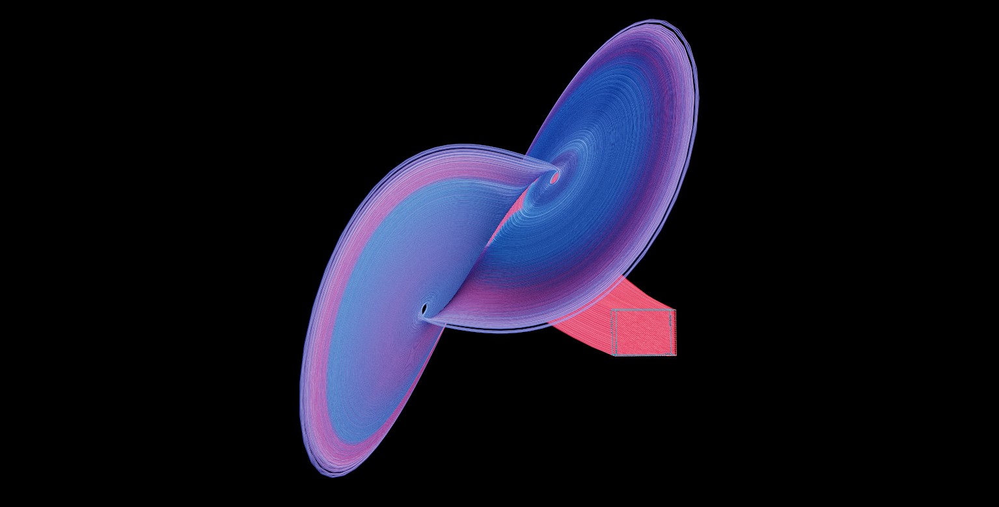

% Asymptotic Behavior
% 👤 [Sébastien Boisgérault](sebastien.boisgerault@minesparis.psl.eu) 


### Control Engineering with Python

- 📖 [Documents (GitHub)](https://github.com/boisgera/control-engineering-with-python)

- ©️ [License CC BY 4.0](https://creativecommons.org/licenses/by/4.0/)

- 🏦 [Mines ParisTech, PSL University](https://mines-paristech.eu/)


## Symbols

|     |             |     |                        |
| --- | ----------- | --- | ---------------------- |
| 🐍  | Code        | 🔍  | Example                |
| 📈  | Graph       | 🧩  | Exercise               |
| 🏷️  | Definition  | 💻  | Computation (Computer) |
| 💎  | Theorem     | 🧮  | Computation (By Hand)  |
| 📝  | Remark      | 🧠  | Theory                 |
| ℹ️  | Information | 🗝️  | Hint                   |
| ⚠️  | Warning     | 🔓  | Solution               |


## 🐍 Imports

```python
from numpy import *
from numpy.linalg import *
from scipy.linalg import *
from matplotlib.pyplot import *
from mpl_toolkits.mplot3d import *
from scipy.integrate import solve_ivp
```

::: hidden :::::::::::::::::::::::::::::::::::::::::::::::::::::::::::::::::::::

```python
# Python 3.x Standard Library
import gc
import os

# Third-Party Packages
import numpy as np; np.seterr(all="ignore")
import numpy.linalg as la
import scipy.misc
import matplotlib as mpl; mpl.use("Agg")
import matplotlib.pyplot as pp
import matplotlib.axes as ax
import matplotlib.patches as pa


#
# Matplotlib Configuration & Helper Functions
# --------------------------------------------------------------------------

# TODO: also reconsider line width and markersize stuff "for the web
#       settings".
fontsize = 10

width = 345 / 72.27
height = width / (16/9)

rc = {
    "text.usetex": True,
    "pgf.preamble": r"\usepackage{amsmath,amsfonts,amssymb}",
    #"font.family": "serif",
    "font.serif": [],
    #"font.sans-serif": [],
    "legend.fontsize": fontsize,
    "axes.titlesize":  fontsize,
    "axes.labelsize":  fontsize,
    "xtick.labelsize": fontsize,
    "ytick.labelsize": fontsize,
    "figure.max_open_warning": 100,
    #"savefig.dpi": 300,
    #"figure.dpi": 300,
    "figure.figsize": [width, height],
    "lines.linewidth": 1.0,
}
mpl.rcParams.update(rc)

# Web target: 160 / 9 inches (that's ~45 cm, this is huge) at 90 dpi
# (the "standard" dpi for Web computations) gives 1600 px.
width_in = 160 / 9

def save(name, **options):
    cwd = os.getcwd()
    root = os.path.dirname(os.path.realpath(__file__))
    os.chdir(root)
    pp.savefig(name + ".svg", **options)
    os.chdir(cwd)

def set_ratio(ratio=1.0, bottom=0.1, top=0.1, left=0.1, right=0.1):
    height_in = (1.0 - left - right)/(1.0 - bottom - top) * width_in / ratio
    pp.gcf().set_size_inches((width_in, height_in))
    pp.gcf().subplots_adjust(bottom=bottom, top=1.0-top, left=left, right=1.0-right)
```

::::::::::::::::::::::::::::::::::::::::::::::::::::::::::::::::::::::::::::::::


🐍 Streamplot Helper
--------------------------------------------------------------------------------

```python
def Q(f, xs, ys):
    X, Y = meshgrid(xs, ys)
    v = vectorize
    fx = v(lambda x, y: f([x, y])[0])
    fy = v(lambda x, y: f([x, y])[1])
    return X, Y, fx(X, Y), fy(X, Y)
```

## ℹ️ Assumption

From now on, we only deal with well-posed systems.

## 🏷️ Asymptotic

**Asymptotic** = Long-Term: when $t \to + \infty$

::: notes ::::::::::::::::::::::::::::::::::::::::::::::::::::::::::::::::::::::

So far, we have given little attention to the properties that characterize
the long-term behavior of dynamical systems. Well-posedness ensures merely
the local (in time) existence of uniqueness of solutions to an IVP and
continuity with respect to the initial condition is only applicable to
solutions defined on a finite (compact) time intervals.

We will now turn to the study of such properties specifically.

::::::::::::::::::::::::::::::::::::::::::::::::::::::::::::::::::::::::::::::::

## ⚠️

Even simple dynamical systems may exhibit

**complex asymptotic behaviors.**


## Lorenz System

$$
\begin{array}{lll}
\dot{x} &=& \sigma (y - x) \\
\dot{y} &=& x (\rho - z) \\
\dot{z} &=& xy - \beta z
\end{array}
$$

::: notes ::::::::::::::::::::::::::::::::::::::::::::::::::::::::::::::::::::::

But first, we need to realize that dynamical systems, even when they are
governed by a simple, low-dimensional system of equations,
may exhibit very complex asymptotic patterns.

The [Lorenz system](https://en.wikipedia.org/wiki/Lorenz_system) is a classical
example of such system.

::::::::::::::::::::::::::::::::::::::::::::::::::::::::::::::::::::::::::::::::

---

[](https://portsmouth.github.io/fibre/?settings=eyJSIjp7InJheUJhdGNoIjoxMjgsIm1heFRpbWVTdGVwcyI6MjI5LCJtYXhJdGVyYXRpb25zIjoxMDAsImludGVncmF0aW9uVGltZSI6MiwiaW50ZWdyYXRlRm9yd2FyZCI6dHJ1ZSwiZ3JpZFNwYWNlIjowLjAzMzA4MjA1NjczMzUyMTgwNCwidHViZVdpZHRoIjowLjAxMzIzMjgyMjY5MzQwODcyMywidHViZVNwcmVhZCI6ZmFsc2UsInJlY29yZF9yZWFsdGltZSI6dHJ1ZSwieG1pbiI6MTguMTI3NTIxNDk3MTg5NjI2LCJ4bWF4IjoyNi43NDEyMjM2ODMyMjY3NzgsInltaW4iOi0xNS4xMDMyMzE2NzQyNjQ5NDUsInltYXgiOi04LjczODI1MzU0Njc5NDE0Mywiem1pbiI6MTkuMjU3MzA2NjExNDgwNjYsInptYXgiOjIxLjU4ODgyMDMyODM4NTQ2MywiY2xpcFRvQm91bmRzIjpmYWxzZSwic2hvd0JvdW5kcyI6dHJ1ZSwiZXhwb3N1cmUiOi0wLjc1MzM5MjIwMzMxNjgyMSwiZ2FtbWEiOjAuOTkyNDYxNzAyMDA1NjU2NSwiY29udHJhc3QiOjEuMTIyMzM0Njk3MzkzOTI2Mywic2F0dXJhdGlvbiI6MS4zODY5OTExNjk1MDI0NzcsInN1YnRyYWN0aXZlQ29sb3IiOmZhbHNlLCJiZ0NvbG9yIjpbMCwwLDBdLCJoYWlyU2hhZGVyIjpmYWxzZSwic3BlY1NoaW5lIjoyMS45NzI4NjIzNzM0NjU0MzIsInNwZWNDb2xvciI6WzAuOTAxOTUzMjc1MDg4MDg4MSwwLjg5MzEwOTkxODYyMzQ5MjEsMC44OTMxMDk5MTg2MjM0OTIxXSwibGlnaHQxX2NvbG9yIjpbMSwwLjksMC44XSwibGlnaHQyX2NvbG9yIjpbMC44LDAuOSwxXSwibGlnaHQxX2RpciI6WzAuNTc3MzUwMjY5MTg5NjI1OCwwLjU3NzM1MDI2OTE4OTYyNTgsMC41NzczNTAyNjkxODk2MjU4XSwibGlnaHQyX2RpciI6Wy0wLjU3NzM1MDI2OTE4OTYyNTgsLTAuNTc3MzUwMjY5MTg5NjI1OCwtMC41NzczNTAyNjkxODk2MjU4XSwiZGVwdGhUZXN0Ijp0cnVlLCJkYXNoX3NwYWNpbmciOjAuNTQwMzQwMjU5OTgwODU3NCwiZGFzaF9zcGVlZCI6MzMuMDgyMDU2NzMzNTIxODksImRhc2hfc2l6ZSI6MC45MTUyNzAyMzYyOTQxMDU1LCJkYXNoZXMiOmZhbHNlLCJzdWJ0cmFjdGl2ZV9jb2xvciI6ZmFsc2UsImhhaXJTaGluZSI6MTAsImhhaXJTcGVjQ29sb3IiOlsxLDEsMV19LCJDIjp7InBvcyI6Wy03LjQyNjkzNjMzNzgzOTcxLC02Ljk5ODI1Mjk3MjIzMzY1OSwxMTcuMTMyNDU3OTg4NDA0MDddLCJ0YXIiOlsxLjE4NTQzMDE1NTUyNDU3NCwtMS4zMzUzOTk3MDQyNDcyNDA1LDI3Ljk0Nzk3NzA0NDE1MDk1N10sIm5lYXIiOjAuMDM0NjQxMDE2MTUxMzc3NTUsImZhciI6MzQ2NDEuMDE2MTUxMzc3NTQ2fSwiRSI6eyJjb2RlIjoiXG4vLy8vLy8vLy8vLy8vLy8vLy8vLy8vLy8vLy8vLy8vLy8vLy8vLy8vLy8vXG4vLyBMb3JlbnogYXR0cmFjdG9yXG4vLy8vLy8vLy8vLy8vLy8vLy8vLy8vLy8vLy8vLy8vLy8vLy8vLy8vLy8vXG5cbmNvbnN0IGZsb2F0IGthcHBhID0gZmxvYXQoMS44NCk7XG5jb25zdCBmbG9hdCBhbHBoYSA9IGZsb2F0KDYuNyk7XG5cbiNkZWZpbmUgcmdiIHZlYzNcblxuY29uc3QgdmVjMyBjb2xMbyA9IHJnYigyNTQsNDUsNzMpIC8gMjU1LjA7XG5jb25zdCB2ZWMzIGNvbEhpID0gcmdiKDUsMTM4LDI1NSkgLyAyNTUuMDtcbmNvbnN0IGZsb2F0IG1hZ1NjYWxlID0gZmxvYXQoMC42KTtcblxuY29uc3QgZmxvYXQgcmhvICAgPSBmbG9hdCgyOC4wKTsgICAgIFxuY29uc3QgZmxvYXQgc2lnbWEgPSBmbG9hdCgxMC4wKTtcbmNvbnN0IGZsb2F0IGJldGEgID0gZmxvYXQoOC4wKS9mbG9hdCgzLjApO1xuXG5cbiB2ZWMzIHZlbG9jaXR5KHZlYzMgcCwgZmxvYXQgdClcbiB7XG4gICAgIHZlYzMgdjtcbiAgICAgZmxvYXQgeCA9IHAueDtcbiAgICAgZmxvYXQgeSA9IHAueTtcbiAgICAgZmxvYXQgeiA9IHAuejtcbiAgICAgdi54ID0gc2lnbWEqKHkgLSB4KTtcbiAgICAgdi55ID0geCoocmhvIC0geik7XG4gICAgIHYueiA9IHgqeSAtIGJldGEqejtcbiAgICAgcmV0dXJuIHY7XG4gfSAgICBcbiBcbiBcbnZlYzMgY29sb3IodmVjMyBwLCBmbG9hdCB0KVxue1xuICAgIHZlYzMgdiA9IHZlbG9jaXR5KHAsIHQpO1xuICBcdGZsb2F0IG1hZzIgPSB0L21hZ1NjYWxlO1xuICAgIGZsb2F0IGxlcnAgPSBtYWcyLygxLjArbWFnMik7XG4gICAgcmV0dXJuICgxLjAtbGVycCkqY29sTG8gKyBsZXJwKmNvbEhpO1xufSAgXG4ifX0%3D)

Visualized with [Fibre](https://github.com/portsmouth/fibre)

::: notes ::::::::::::::::::::::::::::::::::::::::::::::::::::::::::::::::::::::

The solutions $x(t)$ of this system, which are global, have no limit when
$t \to + \infty$ and don't blow up either but instead oscillates forever
between two regions of the state space. This long-term behavior is
quantitatively very sensitive to the choice of the initial condition,
making long-term predictions about the system practically impossible:
the system is chaotic.

::::::::::::::::::::::::::::::::::::::::::::::::::::::::::::::::::::::::::::::::

## Hadley System

$$
\begin{array}{lll}
\dot{x} &=& -y^2 - z^2 - ax + af\\
\dot{y} &=& xy - b xz - y + g \\
\dot{z} &=& bxy + xz - z
\end{array}
$$

---

[](https://portsmouth.github.io/fibre/?settings=eyJSIjp7InJheUJhdGNoIjoxMjgsIm1heFRpbWVTdGVwcyI6MzE5LCJtYXhJdGVyYXRpb25zIjoxMDAsImludGVncmF0aW9uVGltZSI6MjAsImludGVncmF0ZUZvcndhcmQiOnRydWUsImdyaWRTcGFjZSI6MC4wMDUsInR1YmVXaWR0aCI6MC4wMTg3NDc4NDI2MTk1ODA5MzIsInR1YmVTcHJlYWQiOmZhbHNlLCJyZWNvcmRfcmVhbHRpbWUiOnRydWUsInhtaW4iOi0xLjg0MjQzOTkxMzY3MjEzMjEsInhtYXgiOi0xLjY5NzQwMDg2MTM5ODUwMjUsInltaW4iOi0wLjc1MDc5Mzc1MTk1Njc2MDIsInltYXgiOi0wLjI5OTU4ODE4NTU3MDA5MzE1LCJ6bWluIjotMC44MTQyMDU1NzE1Mzg3ODkzLCJ6bWF4IjotMC43NTYwODExMDg1OTM5NzI5LCJjbGlwVG9Cb3VuZHMiOmZhbHNlLCJzaG93Qm91bmRzIjp0cnVlLCJleHBvc3VyZSI6LTEuMTc3NDg1ODI2MDc5NTYxLCJnYW1tYSI6MS4wMjU2MTcyNzI3MTgyNTEsImNvbnRyYXN0IjoxLjI5MDI5MjY5NzkzNTg2NDIsInNhdHVyYXRpb24iOjEuNDU1NzE0ODM4Njk2ODcyMywic3VidHJhY3RpdmVDb2xvciI6ZmFsc2UsImJnQ29sb3IiOlswLDAsMF0sImhhaXJTaGFkZXIiOmZhbHNlLCJzcGVjU2hpbmUiOjMxLjg5NzQ4MDA3NzUzNjA3Nywic3BlY0NvbG9yIjpbMSwxLDFdLCJsaWdodDFfY29sb3IiOlsxLDAuOSwwLjhdLCJsaWdodDJfY29sb3IiOlswLjgsMC45LDFdLCJsaWdodDFfZGlyIjpbMC41NzczNTAyNjkxODk2MjU4LDAuNTc3MzUwMjY5MTg5NjI1OCwwLjU3NzM1MDI2OTE4OTYyNThdLCJsaWdodDJfZGlyIjpbLTAuNTc3MzUwMjY5MTg5NjI1OCwtMC41NzczNTAyNjkxODk2MjU4LC0wLjU3NzM1MDI2OTE4OTYyNThdLCJkZXB0aFRlc3QiOnRydWUsImRhc2hfc3BhY2luZyI6MC41NDAzNDAyNTk5ODA4NTc0LCJkYXNoX3NwZWVkIjozMy4wODIwNTY3MzM1MjE4OSwiZGFzaF9zaXplIjowLjkxNTI3MDIzNjI5NDEwNTUsImRhc2hlcyI6ZmFsc2UsInN1YnRyYWN0aXZlX2NvbG9yIjpmYWxzZSwiaGFpclNoaW5lIjoxMCwiaGFpclNwZWNDb2xvciI6WzEsMSwxXX0sIkMiOnsicG9zIjpbLTQuMjgwNDkyMTM4MTY3OTY3NSwwLjg4NDU1MjA5Nzk1NTE3MSwtMy40OTI3MzM4Njc0MzM3ODFdLCJ0YXIiOlswLjQ0MzkwMDY5MjE1MTE1OTUsMC4xMDk3ODc2ODUzODYxNzI1MywtMC4xNDE1NTE2NDc4Mzk3MTEzXSwibmVhciI6MC4wMzQ2NDEwMTYxNTEzNzc1NSwiZmFyIjozNDY0MS4wMTYxNTEzNzc1NDZ9LCJFIjp7ImNvZGUiOiJcbi8vLy8vLy8vLy8vLy8vLy8vLy8vLy8vLy8vLy8vLy8vLy8vLy8vLy8vLy9cbi8vIEhhZGxleSBhdHRyYWN0b3Jcbi8vLy8vLy8vLy8vLy8vLy8vLy8vLy8vLy8vLy8vLy8vLy8vLy8vLy8vLy9cblxuY29uc3QgZmxvYXQgYSA9IGZsb2F0KDAuMik7XG5jb25zdCBmbG9hdCBiID0gZmxvYXQoNC4wKTtcbmNvbnN0IGZsb2F0IGYgPSBmbG9hdCg4LjApO1xuY29uc3QgZmxvYXQgZyA9IGZsb2F0KDEuMCk7XG5cbiNkZWZpbmUgcmdiIHZlYzNcblxuY29uc3QgdmVjMyBjb2xMbyA9IHJnYigyNTUsNjEsODcpIC8gMjU1LjA7XG5jb25zdCB2ZWMzIGNvbEhpID0gcmdiKDg2LDE3NiwyNTQpIC8gMjU1LjA7XG5jb25zdCBmbG9hdCBtYWdTY2FsZSA9IGZsb2F0KDYpO1xuXG52ZWMzIHZlbG9jaXR5KHZlYzMgcCwgZmxvYXQgdClcbntcbiAgICB2ZWMzIHY7XG4gICAgZmxvYXQgeCA9IHAueDtcbiAgICBmbG9hdCB5ID0gcC55O1xuICAgIGZsb2F0IHogPSBwLno7XG4gICAgdi54ID0gLXkqeSAteip6IC1hKnggKyBhKmY7XG4gICAgdi55ID0geCp5IC0gYip4KnogLSB5ICsgZztcbiAgICB2LnogPSBiKngqeSArIHgqeiAtIHo7XG4gICAgcmV0dXJuIHY7XG59ICAgIFxuIFxudmVjMyBjb2xvcih2ZWMzIHAsIGZsb2F0IHQpXG57XG4gICAgdmVjMyB2ID0gdmVsb2NpdHkocCwgdCk7XG4gICAgZmxvYXQgbWFnMiA9IHQvbWFnU2NhbGU7XG4gICAgZmxvYXQgbGVycCA9IG1hZzIvKDEuMCttYWcyKTtcbiAgICByZXR1cm4gKDEuMC1sZXJwKSpjb2xMbyArIGxlcnAqY29sSGk7XG59ICBcbiJ9fQ%3D%3D)

Visualized with [Fibre](https://github.com/portsmouth/fibre)

::: notes ::::::::::::::::::::::::::::::::::::::::::::::::::::::::::::::::::::::

Asymptotic patterns of chaotic system are by no means restricted to this
"switching" behavior. The Hadley system is another -- even "messier" --
example of chaotic behavior.

Fortunately, many systems behaved more predictabily, and/or can be controlled
so that their asymptotic behavior is more acceptable.

::::::::::::::::::::::::::::::::::::::::::::::::::::::::::::::::::::::::::::::::

## 🏷️ Equilibrium

An **equilibrium** of system $\dot{x} = f(x)$ is a state $x_e$
such that the maximal solution $x(t)$ such that $x(0) = x_e$

- is global and,

- is $x(t) = x_e$ for any $t > 0$.

## 💎 Equilibrium

The state $x_e$ is an equilibrium of $\dot{x} = f(x)$

$$\Longleftrightarrow$$

$$f(x_e) = 0.$$

::: notes ::::::::::::::::::::::::::::::::::::::::::::::::::::::::::::::::::::::

If $f(x_e) = 0$, then $d x_e / dt = f(x_e) = 0$ and thus the (constant)
function $t \in \left[0, +\infty \right) \mapsto x_e$ is a global solution
of the IVP $\dot{x} =f(x)$ and $x_e = 0$.

Conversely, if $x(t):= x_e$, $t\geq 0$ is a global solution of $\dot{x} = f(x)$,
then $0 = \dot{x}(0) = f(x(0)) = f(x_e)$.

::::::::::::::::::::::::::::::::::::::::::::::::::::::::::::::::::::::::::::::::

## Stability

About the long-term behavior of solutions.

- "Stability" subtle concept,

- "Asymptotic Stability" simpler (and stronger),

- "Attractivity" simpler yet, (but often too weak).

## Attractivity

**Context:** system $\dot{x} = f(x)$ with equilibrium $x_e$.

## 🏷️ Global Attractivity

The equilibrium $x_e$ is **globally attractive** if for every $x_0,$
the maximal solution $x(t)$ such that $x(0)=x_0$

- is global and,

- $x(t) \to  x_e$ when $t \to +\infty$.

## 🏷️ Local Attractivity

The equilibrium $x_e$ is **locally attractive**
if for every $x_0$ **close enough to $x_e$**,
the maximal solution $x(t)$ such that $x(0)=x_0$

- is global and,

- $x(t) \to  x_e$ when $t \to +\infty$.

::: notes ::::::::::::::::::::::::::::::::::::::::::::::::::::::::::::::::::::::

Technically, an equilibrium $x_e$ is **locally attractive** if there is a $r>0$
such that the maximal solution to the IVP $\dot{x} = f(x)$ and $x(0) = x_0$
is global and satisfies $x(t) \to +\infty$ when $t \to +\infty$ whenever
$\|x_0 - x_e\| \leq r$.

::::::::::::::::::::::::::::::::::::::::::::::::::::::::::::::::::::::::::::::::

## 🔍 Global Attractivity

The system

$$
\begin{array}{cc}
\dot{x} &=& -2x + y \\
\dot{y} &=& -2y + x
\end{array}
$$

- is well-posed,

- has an equilibrium at $(0, 0)$.

---

### 🐍 Vector field

```python
def f(xy):
    x, y = xy
    dx = -2*x + y
    dy = -2*y + x
    return array([dx, dy])
```

---

### 📈 Stream plot

```python
figure()
x = y = linspace(-5.0, 5.0, 1000)
streamplot(*Q(f, x, y), color="k")
plot([0], [0], "k.", ms=20.0)
axis("square")
axis("off")
```

::: hidden :::::::::::::::::::::::::::::::::::::::::::::::::::::::::::::::::::::

    tight_layout()
    save("images/globally-attractive")

::::::::::::::::::::::::::::::::::::::::::::::::::::::::::::::::::::::::::::::::

::: slides :::::::::::::::::::::::::::::::::::::::::::::::::::::::::::::::::::::

## {.section data-background="images/globally-attractive.svg" data-background-size="contain"}

::::::::::::::::::::::::::::::::::::::::::::::::::::::::::::::::::::::::::::::::

::: hidden :::::::::::::::::::::::::::::::::::::::::::::::::::::::::::::::::::::

```python
import matplotlib.animation as ani
from matplotlib.colors import to_rgb
from tqdm import tqdm


neutral = grey_4 = to_rgb("#ced4da")
#grey_5 = to_rgb("#adb5bd")
#grey_8 = to_rgb("#343a40")
good = to_rgb("#51cf66")
bad = to_rgb("#ff6b6b")

ft = lambda t, y: f(y)
fps = df = 60.0
dt = 1.0 / df
t_span = t_i, t_f = (0.0, 3.0)
t = np.arange(t_i, t_f + dt, dt)

y0s = [[-4.0, 1.0], [4.0, -1.0]]
colors = [good, good]
xys = []
for y0 in tqdm(y0s):
    r = solve_ivp(fun=ft, y0=y0, t_span=t_span, t_eval=t)
    xys.append(r.y)


fig = figure()
x = y = linspace(-5.0, 5.0, 1000)
streamplot(*Q(f, x, y), color=grey_4)
plot([0], [0], lw=3.0, marker="o", ms=10.0, markevery=[-1],
        markeredgecolor="white", color=neutral)
axis("square")
axis("off")

lines = []
for x, y in xys:
    line = plot(
        [x[0]], [y[0]],
        lw=3.0,
        ms=10.0,
        color=neutral,
        marker="o", markevery=[-1],
        markeredgecolor="white")[0]
    lines.append(line)
tight_layout()

num_frames = len(t) * len(lines)

def gamma(x):
    return pow(x, 0.5)

def update(i):
    j, k = divmod(i, len(t))
    x, y = xys[j]
    line = lines[j]
    line.set_data(x[:k+1], y[:k+1])
    alpha = gamma(k / (len(t)-1))
    final_color = colors[j]
    line.set_color(
      tuple((1-alpha)*array(neutral) + alpha*array(final_color))
    )

animation = ani.FuncAnimation(fig, func=update, frames=num_frames)
writer = ani.FFMpegWriter(fps=fps)
bar = tqdm(total=num_frames)
animation.save("videos/globally-attractive.mp4", writer=writer, dpi=300,
progress_callback = lambda i, n: bar.update(1))
bar.close()
```

::::::::::::::::::::::::::::::::::::::::::::::::::::::::::::::::::::::::::::::::

---

```{=html}
<video controls style="width:100vw;">
  <source src="videos/globally-attractive.mp4" type="video/mp4">
  Your browser does not support the video tag.
</video>
```

## 🔍 Local Attractivity

The system

$$
\begin{array}{cc}
\dot{x} &=& -2x + y^3 \\
\dot{y} &=& -2y + x^3
\end{array}
$$

- is well-posed,

- has an equilibrium at $(0, 0)$.

---

### 🐍 Vector field

```python
def f(xy):
    x, y = xy
    dx = -2*x + y**3
    dy = -2*y + x**3
    return array([dx, dy])
```

---

### 📈 Stream plot

```python
figure()
x = y = linspace(-5.0, 5.0, 1000)
streamplot(*Q(f, x, y), color="k")
plot([0], [0], "k.", ms=10.0)
axis("square")
axis("off")
```

::: hidden :::::::::::::::::::::::::::::::::::::::::::::::::::::::::::::::::::::

    tight_layout()
    save("images/locally-attractive")

::::::::::::::::::::::::::::::::::::::::::::::::::::::::::::::::::::::::::::::::

::: slides :::::::::::::::::::::::::::::::::::::::::::::::::::::::::::::::::::::

## {.section data-background="images/locally-attractive.svg" data-background-size="contain"}

::::::::::::::::::::::::::::::::::::::::::::::::::::::::::::::::::::::::::::::::

::: hidden :::::::::::::::::::::::::::::::::::::::::::::::::::::::::::::::::::::

```python
import matplotlib.animation as ani
from matplotlib.colors import to_rgb
from tqdm import tqdm


neutral = grey_4 = to_rgb("#ced4da")
#grey_5 = to_rgb("#adb5bd")
#grey_8 = to_rgb("#343a40")
good = to_rgb("#51cf66")
bad = to_rgb("#ff6b6b")

ft = lambda t, y: f(y)
fps = df = 60.0
dt = 1.0 / df
t_span = t_i, t_f = (0.0, 3.0)
t = np.arange(t_i, t_f + dt, dt)

y0s = [[-2.4, 0.0], [-1.8, 0.0], [-1.2, 0.0]]
colors = [bad, good, good]
xys = []
for y0 in tqdm(y0s):
    r = solve_ivp(fun=ft, y0=y0, t_span=t_span, t_eval=t)
    xys.append(r.y)


fig = figure()
x = y = linspace(-5.0, 5.0, 1000)
streamplot(*Q(f, x, y), color=grey_4)
plot([0], [0], lw=3.0, marker="o", ms=10.0, markevery=[-1],
        markeredgecolor="white", color=neutral)
axis("square")
axis("off")

lines = []
for x, y in xys:
    line = plot(
        [x[0]], [y[0]],
        lw=3.0,
        ms=10.0,
        color=neutral,
        marker="o", markevery=[-1],
        markeredgecolor="white")[0]
    lines.append(line)
tight_layout()

num_frames = len(t) * len(lines)

def gamma(x):
    return pow(x, 0.5)

def update(i):
    j, k = divmod(i, len(t))
    x, y = xys[j]
    line = lines[j]
    line.set_data(x[:k+1], y[:k+1])
    alpha = gamma(k / (len(t)-1))
    final_color = colors[j]
    line.set_color(
      tuple((1-alpha)*array(neutral) + alpha*array(final_color))
    )

animation = ani.FuncAnimation(fig, func=update, frames=num_frames)
writer = ani.FFMpegWriter(fps=fps)
bar = tqdm(total=num_frames)
animation.save("videos/locally-attractive.mp4", writer=writer, dpi=300,
progress_callback = lambda i, n: bar.update(1))
bar.close()
```

::::::::::::::::::::::::::::::::::::::::::::::::::::::::::::::::::::::::::::::::

---

```{=html}
<video controls style="width:100vw;">
  <source src="videos/locally-attractive.mp4" type="video/mp4">
  Your browser does not support the video tag.
</video>
```

## 🔍 No Attractivity

The system

$$
\begin{array}{cr}
\dot{x} &=& -2x + y \\
\dot{y} &=&  2y - x
\end{array}
$$

- is well-posed,

- has a (unique) equilibrium at $(0, 0)$.

---

### 🐍 Vector field

```python
def f(xy):
    x, y = xy
    dx = -2*x + y
    dy =  2*y - x
    return array([dx, dy])
```

---

### 📈 Stream plot

```python
figure()
x = y = linspace(-5.0, 5.0, 1000)
streamplot(*Q(f, x, y), color="k")
plot([0], [0], "k.", ms=10.0)
axis("square")
axis("off")
```

::: hidden :::::::::::::::::::::::::::::::::::::::::::::::::::::::::::::::::::::

    tight_layout()
    save("images/not-attractive")

::::::::::::::::::::::::::::::::::::::::::::::::::::::::::::::::::::::::::::::::

::: slides :::::::::::::::::::::::::::::::::::::::::::::::::::::::::::::::::::::

## {.section data-background="images/not-attractive.svg" data-background-size="contain"}

::::::::::::::::::::::::::::::::::::::::::::::::::::::::::::::::::::::::::::::::

::: hidden :::::::::::::::::::::::::::::::::::::::::::::::::::::::::::::::::::::

```python
import matplotlib.animation as ani
from matplotlib.colors import to_rgb
from tqdm import tqdm


neutral = grey_4 = to_rgb("#ced4da")
#grey_5 = to_rgb("#adb5bd")
#grey_8 = to_rgb("#343a40")
good = to_rgb("#51cf66")
bad = to_rgb("#ff6b6b")

ft = lambda t, y: f(y)
fps = df = 60.0
dt = 1.0 / df
t_span = t_i, t_f = (0.0, 3.0)
t = np.arange(t_i, t_f + dt, dt)

y0s = [[-4*0.9659258262890683, -4*0.2588190451025208],
       [-4*0.9659258262890683, -4*0.2588190451025208 + 0.2],
       [0.2*0.9659258262890683, 0.2*0.2588190451025208 - 0.2]]
colors = [good, bad, bad]
xys = []
for y0 in tqdm(y0s):
    r = solve_ivp(fun=ft, y0=y0, t_span=t_span, t_eval=t)
    xys.append(r.y)


fig = figure()
x = y = linspace(-5.0, 5.0, 1000)
streamplot(*Q(f, x, y), color=grey_4)
plot([0], [0], lw=3.0, marker="o", ms=10.0, markevery=[-1],
        markeredgecolor="white", color=neutral)
axis("square")
axis("off")

lines = []
for x, y in xys:
    line = plot(
        [x[0]], [y[0]],
        lw=3.0,
        ms=10.0,
        color=neutral,
        marker="o", markevery=[-1],
        markeredgecolor="white")[0]
    lines.append(line)
tight_layout()

num_frames = len(t) * len(lines)

def gamma(x):
    return pow(x, 0.5)

def update(i):
    j, k = divmod(i, len(t))
    x, y = xys[j]
    line = lines[j]
    line.set_data(x[:k+1], y[:k+1])
    alpha = gamma(k / (len(t)-1))
    final_color = colors[j]
    line.set_color(
      tuple((1-alpha)*array(neutral) + alpha*array(final_color))
    )

animation = ani.FuncAnimation(fig, func=update, frames=num_frames)
writer = ani.FFMpegWriter(fps=fps)
bar = tqdm(total=num_frames)
animation.save("videos/not-attractive.mp4", writer=writer, dpi=300,
progress_callback = lambda i, n: bar.update(1))
bar.close()
```

::::::::::::::::::::::::::::::::::::::::::::::::::::::::::::::::::::::::::::::::

---

```{=html}
<video controls style="width:100vw;">
  <source src="videos/not-attractive.mp4" type="video/mp4">
  Your browser does not support the video tag.
</video>
```

## 🧩 Pendulum

The pendulum is governed by the equation

$$
m \ell^2 \ddot{\theta} + b \dot{\theta} + m g \ell \sin \theta = 0
$$

where $m>0$, $\ell>0$, $g>0$ and $b\geq0$.

---

### 1. 🧮

Compute the equilibria of this system.

---

### 2. 🧠

Can any of these equilibria be **globally** attractive?

---


### 3.  📈

Assume that $m=1$, $\ell=1$, $g=9.81$ and $b=1$.

Make a stream plot of the system.

---

### 4. 🔬

Determine which equilibria are locally attractive.

---


### 5. 📈 Frictionless Pendulum

Assume now that $b=0$.

Make a stream plot of the system.

---

### 6. 🧮 🧠

Prove that the equilibrium  at $(0,0)$ is not locally attractive.

**🗝️ Hint.** Study how the total mechanical energy $E$

$$
E(\theta,\dot{\theta}) := m\ell^2 \dot{\theta}^2 / 2 - m g\ell \cos \theta
$$

evolves in time.

## 🔓 Pendulum

---

### 1. 🔓

The 2nd-order differential equations of the pendulum are equivalent to
the first order system

$$
\left|
\begin{array}{rcl}
\dot{\theta} &=& \omega \\
\dot{\omega} &=& (- b / m \ell^2) \omega - (g /\ell) \sin \theta \\
\end{array}
\right.
$$

---

Thus, the system state is $x =(\theta, \omega)$ and is governed by $\dot{x} = f(x)$ with

$$
f(\theta, \omega) = (\omega, (- b / m \ell^2) \omega - (g /\ell) \sin \theta).
$$

Hence, the state $(\theta, \omega)$ is a solution to $f(\theta, \omega) = 0$
if and only if $\omega = 0$ and $\sin \theta = 0$. In other words, the equilibria
of the system are characterized by $\theta = k \pi$ for some $k \in \mathbb{Z}$
and $\omega (= \dot{\theta}) = 0$.

---

### 2. 🔓

Since there are several equilibria, none of them can be globally attractive.

Indeed let $x_1$ be a globally attractive equilibrium and assume that $x_2$ is
any other equilibrium.
By definition, the maximal solution $x(t)$ such that
$x(0) = x_2$ is $x(t) = x_2$ for every $t\geq0$.
On the other hand, since $x_1$ is globally attractive, it also satisfies $x(t) \to x_1$ when $t\to +\infty$, hence there is a contradiction.

Thus, $x_1$ is the only possible equilibrium.

---

### 3. 🔓

```python
m = l = b = 1; g=9.81

def f(theta_omega):
    theta, omega = theta_omega
    d_theta = omega
    d_omega = - b / (m * l * l) * omega
    d_omega -=  (g / l) * sin(theta)
    return (d_theta, d_omega)
```

---

```python
figure()
theta = linspace(-2*pi*(1.2), 2*pi*(1.2), 1000)
d_theta = linspace(-5.0, 5.0, 1000)
streamplot(*Q(f, theta, d_theta), color="k")
plot([-2*pi, -pi, 0 ,pi, 2*pi], 5*[0.0], "k.")
xticks([-2*pi, -pi, 0 ,pi, 2*pi],
[r"$-2\pi$", r"$\pi$", r"$0$", r"$\pi$", r"$2\pi$"])
grid(True)
```

::: hidden :::::::::::::::::::::::::::::::::::::::::::::::::::::::::::::::::::::

    tight_layout()
    save("images/pendulum-friction")

::::::::::::::::::::::::::::::::::::::::::::::::::::::::::::::::::::::::::::::::

::: slides :::::::::::::::::::::::::::::::::::::::::::::::::::::::::::::::::::::

## {.section data-background="images/pendulum-friction.svg" data-background-size="contain"}

::::::::::::::::::::::::::::::::::::::::::::::::::::::::::::::::::::::::::::::::

---

### 4. 🔓

From the streamplot, we see that the equilibria 
  
$$(\theta, \dot{\theta}) = (2k\pi, 0), \; k\in \mathbb{Z}$$ 
    
are asymptotically stable, but that the equilibria 
  
$$(\theta, \dot{\theta}) = (2(k+1) \pi, 0),\; k\in \mathbb{Z}$$ 
    
are not (they are not locally attractive).

---

### 5. 🔓

```python
b = 0
figure()
streamplot(*Q(f, theta, d_theta), color="k")
plot([-2*pi, -pi, 0 ,pi, 2*pi], 5*[0.0], "k.")
xticks([-2*pi, -pi, 0 ,pi, 2*pi],
[r"$-2\pi$", r"$\pi$", r"$0$", r"$\pi$", r"$2\pi$"])
grid(True)
```

::: hidden :::::::::::::::::::::::::::::::::::::::::::::::::::::::::::::::::::::

    tight_layout()
    save("images/pendulum-no-friction")

::::::::::::::::::::::::::::::::::::::::::::::::::::::::::::::::::::::::::::::::

::: slides :::::::::::::::::::::::::::::::::::::::::::::::::::::::::::::::::::::

## {.section data-background="images/pendulum-no-friction.svg" data-background-size="contain"}

::::::::::::::::::::::::::::::::::::::::::::::::::::::::::::::::::::::::::::::::

---

### 6. 🔓

$$
\begin{split}
\dot{E} 
  &= \frac{d}{dt} \left(m\ell^2 \dot{\theta}^2 / 2 - m g\ell \cos \theta\right) \\
  &= m\ell^2 \ddot{\theta}\dot{\theta} + m g \ell (\sin \theta) \dot{\theta} \\
  &= \left(m\ell^2 \ddot{\theta} + m g \ell \sin \theta \right)\dot{\theta} \\
  &= \left(- b \dot{\theta}\right)\dot{\theta} \\
  &= 0
\end{split}
$$

Therefore, $E(t)$ is constant. 


--------------------------------------------------------------------------------


On the other hand,

$$
\min \, \{E(\theta, \dot{\theta}) \; | \; (\theta,\dot{\theta}) \in \mathbb{R}^2\}
= E(0, 0)
= -mgl.
$$

Moreover, this minimum is locally strict. Precisely, for any $0< |\theta| < \pi$,
$$
E(0, 0) < E(\theta,\dot{\theta}).
$$

--------------------------------------------------------------------------------

If the origin was locally attractive, for any $\theta(0)$ and $\dot{\theta}(0)$ small enough, we would have
$$
E(\theta(t), \dot{\theta}(t)) \to E(0, 0) 
\; \mbox{ when } \;
t\to +\infty
$$
(by continuity). But if $0 < |\theta(0)| < \pi$, we have

$$E(\theta(0), \dot{\theta}(0)) > E(0, 0)$$

and that would contradict that $E(t)$ is constant. 

Hence the origin is not locally attractive.

## 💎 Attractivity (Low-level)

The equilibrium $x_e$ is **globally attractive** iff:

- for any state $x_0$ and for any $\epsilon > 0$ there is a $\tau \geq 0$,

- such that the maximal solution $x(t)$ such that $x(0) = x_0$ is global and,
- satisfies:

  $$
  \|x(t) - x_e\| \leq \epsilon \; \mbox{ when } \; t \geq \tau.
  $$

## ⚠️ Warning

- Very close values of $x_0$ could **theoretically** lead to very different
  "speed of convergence" of $x(t)$ towards the equilibrium.

- This is not contradictory with the well-posedness assumption:
  continuity w.r.t. the initial condition only works with finite time spans.

## 🔍 (Pathological) Example

$$
\begin{array}{lll}
\dot{x} &=& x + xy - (x + y)\sqrt{x^2 + y^2} \\
\dot{y} &=& y - x^2 + (x - y) \sqrt{x^2 + y^2}
\end{array}
$$

---

Equivalently, in polar coordinates:

$$
\begin{array}{lll}
\dot{r} &=& r (1 - r) \\
\dot{\theta} &=& r (1 - \cos \theta)
\end{array}
$$

---

###  🐍 Vector Field

```python
def f(xy):
    x, y = xy
    r = sqrt(x*x + y*y)
    dx = x + x * y - (x + y) * r
    dy = y - x * x + (x - y) * r
    return array([dx, dy])
```

---

### 📈 Stream Plot

```python
figure()
x = y = linspace(-2.0, 2.0, 1000)
streamplot(*Q(f, x, y), color="k")
plot([1], [0], "k.", ms=20.0)
axis("square")
axis("off")
```


::: hidden :::::::::::::::::::::::::::::::::::::::::::::::::::::::::::::::::::::

    tight_layout()
    save("images/attractive2")

::::::::::::::::::::::::::::::::::::::::::::::::::::::::::::::::::::::::::::::::

::: slides :::::::::::::::::::::::::::::::::::::::::::::::::::::::::::::::::::::

## {.section data-background="images/attractive2.svg" data-background-size="contain"}

::::::::::::::::::::::::::::::::::::::::::::::::::::::::::::::::::::::::::::::::

::: hidden :::::::::::::::::::::::::::::::::::::::::::::::::::::::::::::::::::::

```python
import matplotlib.animation as ani
from matplotlib.colors import to_rgb
from tqdm import tqdm

neutral = grey_4 = to_rgb("#ced4da")
#grey_5 = to_rgb("#adb5bd")
#grey_8 = to_rgb("#343a40")
good = to_rgb("#51cf66")
bad = to_rgb("#ff6b6b")

ft = lambda t, y: f(y)
fps = df = 60.0
dt = 1.0 / df
t_span = t_i, t_f = (0.0, 10.0)
t = np.arange(t_i, t_f + 0.1*dt, dt)

y0s = [[1.5*cos(theta), 1.5*sin(theta)] for theta in linspace(0, (11/12)*2*pi, 12)]
# colors = [good] * len(y0s)
xys = []
for y0 in tqdm(y0s):
    r = solve_ivp(fun=ft, y0=y0, t_span=t_span, t_eval=t)
    xys.append(r.y)


fig = figure()
x = y = linspace(-2.0, 2.0, 1000)
streamplot(*Q(f, x, y), color=grey_4)
plot([1], [0], lw=3.0, marker="o", ms=10.0, markevery=[-1],
        markeredgecolor="white", color=neutral)
axis("square")
axis("off")

lines = []
for x, y in xys:
    line = plot(
        [x[0]], [y[0]],
        lw=3.0,
        ms=10.0,
        #color=neutral,
        marker="o", markevery=[-1],
        markeredgecolor="white")[0]
    lines.append(line)
tight_layout()

num_frames = len(t)

def gamma(x):
    return pow(x, 0.5)

def update(i):
  for line, (x, y) in zip(lines, xys):
      line.set_data(x[:i+1], y[:i+1])
    # j, k = divmod(i, len(t))
    # x, y = xys[j]
    # line = lines[j]
    # line.set_data(x[:k+1], y[:k+1])
    # alpha = gamma(k / (len(t)-1))
    # final_color = colors[j]
    # line.set_color(
    #   tuple((1-alpha)*array(neutral) + alpha*array(final_color))
    # )

animation = ani.FuncAnimation(fig, func=update, frames=num_frames)
writer = ani.FFMpegWriter(fps=fps)
bar = tqdm(total=num_frames)
animation.save("videos/pathological.mp4", writer=writer, dpi=300,
progress_callback = lambda i, n: bar.update(1))
bar.close()
```

::::::::::::::::::::::::::::::::::::::::::::::::::::::::::::::::::::::::::::::::

---

```{=html}
<video controls style="width:100vw;">
  <source src="videos/pathological.mp4" type="video/mp4">
  Your browser does not support the video tag.
</video>
```

## Asymptotic Stability

Asymptotic stability is a stronger version of attractivity
which is by definition robust with respect to the choice of
the initial state.

## 🏷️ Global Asympt. Stability

The equilibrium $x_e$ is **globally asympt. stable** iff:

- for any state $x_0$ and for any $\epsilon > 0$ there is a $\tau \geq 0$,

- and there is a $r > 0$ such that if $\|x_0' - x_0\| \leq r$,

- such that the maximal solution $x(t)$ such that $x(0) = x_0'$ is global and,
- satisfies:

  $$
  \|x(t) - x_e\| \leq \epsilon \; \mbox{ when } \; t \geq \tau.
  $$

::: notes ::::::::::::::::::::::::::::::::::::::::::::::::::::::::::::::::::::::

Global asymptotic stability is requirement which is very similar to attractivity.
The only difference is that it requires the time $\tau$ that we should wait
to be sure that the distance between $x(t)$ and the equilibrium is less that
$\varepsilon$ should be valid not only for the initial condition $x(0) = x_0$
but also for any other initial condition in an (arbitrary small) neighbourhood
of $x_0$. There is a common profile for the "speed of convergence" towards the equilibrium between an initial condition and its neighbors ;
this condition is not always met if we merely have an attractive equilibrium.

::::::::::::::::::::::::::::::::::::::::::::::::::::::::::::::::::::::::::::::::

<!--

--------------------------------------------------------------------------------

Equivalently:

  - **for any $r>0$**, for any $\epsilon > 0$,
    there is a $\tau \geq 0$ such the maximal solution $x(t)$
    **such that $\|x(0) - x_e\| \leq r$** exists for all $t \geq 0$ and
    satisfies:

    $$
    \|x(t) - x_e\| \leq \epsilon \; \mbox{ when } \; t \geq \tau.
    $$

The equilibrium $x_e$ is **globally attractive** if for every $x_0,$
the maximal solution $x(t)$ such that $x(0)=x_0$

  - is global and,

  - $x(t) \to  x_e$ when $t \to +\infty$.

-->

## Set of Initial Conditions

Let $f: \mathbb{R}^n \to \mathbb{R}^n$ and $X_0 \subset \mathbb{R}^n$.

Let $X(t)$ be the image of $X_0$ by the flow at time $t$:

$$
X(t) := \{x(t) \; | \; \dot{x} = f(x), \; x(0)= x_0, \; x_0 \in X_0 \ \}.
$$

## 💎 Global Asympt. Stability

An equilibrium $x_e$ is globally asympt. stable iff

- for every bounded set $X_0$ and any $x_0 \in X_0$
  the associated maximal solution $x(t)$ is global and,

- $X(t) \to \{x_e\}$ when $t\to +\infty$.

## 🏷️ Limits of Sets

$$
X(t) \to \{x_e\}
$$

to be interpreted as

$$
\sup_{x(t) \in X(t)} \|x(t) - x_e\| \to 0.
$$

## 🏷️ Hausdorff Distance

$$
\sup_{x(t) \in X(t)} \|x(t) - x_e\| = d_H(X(t), \{x_e\})
$$

where $d_H$ is the [**Hausdorff distance**](https://en.wikipedia.org/wiki/Hausdorff_distance) between sets:

$$
d_H(A, B) := \max \left\{ \sup_{a \in A} d(a, B), \sup_{b\in B} d(A, b) \right\}.
$$

::: hidden :::::::::::::::::::::::::::::::::::::::::::::::::::::::::::::::::::::

```python

# Third-Party Libraries
import numpy as np
import matplotlib.pyplot as plt

# Local Library
import mivp

# ------------------------------------------------------------------------------

# Vector field
def fun(t, xy):
    x, y = xy
    dx = -2*x + y
    dy = -2*y + x
    return array([dx, dy])

# Streamplot
fig = figure()
x = y = linspace(-5.0, 5.0, 1000)
streamplot(*Q(lambda xy: fun(0, xy), x, y), color=grey_4)
plot([0], [0], lw=3.0, marker="o", ms=10.0, markevery=[-1],
        markeredgecolor="white", color=neutral)
axis("square")
axis("off")
tight_layout()

# Time span & frame rate
t_span = (0.0, 10.0)

df = 60.0
dt = 1.0 / df
t = np.arange(t_span[0], t_span[1], dt)
t = np.r_[t, t_span[1]]

# Initial set boundary
y0 = [2.5, 0.0]
radius = 2.0
xc, yc = y0

def boundary(t):  # we assume that t is a 1-dim array
    return np.array(
        [
            [xc + radius * np.cos(theta), yc + radius * np.sin(theta)]
            for theta in 2 * np.pi * t
        ]
    )

# Precision
rtol = 1e-6  # default: 1e-3
atol = 1e-12  # default: 1e-6

# ------------------------------------------------------------------------------

data = mivp.solve_alt(
    fun=fun,
    t_eval=t,
    boundary=boundary,
    boundary_rtol=0.0,
    boundary_atol=0.1,
    rtol=rtol,
    atol=atol,
    method="LSODA",
)

good = to_rgb("#51cf66")
bad = to_rgb("#ff6b6b")
mivp.generate_movie(data, filename="videos/gas.mp4", fps=df,
    axes=gca(), zorder=1000, color=good, linewidth=3.0,
)
```

::::::::::::::::::::::::::::::::::::::::::::::::::::::::::::::::::::::::::::::::

---

```{=html}
<video controls style="width:100vw;">
  <source src="videos/gas.mp4" type="video/mp4">
  Your browser does not support the video tag.
</video>
```

::: hidden :::::::::::::::::::::::::::::::::::::::::::::::::::::::::::::::::::::

```python

# Third-Party Libraries
import numpy as np
import matplotlib.pyplot as plt

# Local Library
import mivp

# ------------------------------------------------------------------------------

# Vector field
def fun(t, xy):
    x, y = xy
    r = np.sqrt(x * x + y * y)
    dx = x + x * y - (x + y) * r
    dy = y - x * x + (x - y) * r
    return [dx, dy]

# Streamplot
fig = figure()
x = y = linspace(-2.0, 2.0, 1000)
streamplot(*Q(f, x, y), color=grey_4)
plot([1], [0], lw=3.0, marker="o", ms=10.0, markevery=[-1],
        markeredgecolor="white", color=neutral)
axis("square")
axis("off")
tight_layout()

# Time span & frame rate
t_span = (0.0, 10.0)

df = 60.0
dt = 1.0 / df
t = np.arange(t_span[0], t_span[1], dt)
t = np.r_[t, t_span[1]]

# Initial set boundary
y0 = [1.0, 0.0]
radius = 0.5
n = 10000
xc, yc = y0

def boundary(t):  # we assume that t is a 1-dim array
    return np.array(
        [
            [xc + radius * np.cos(theta), yc + radius * np.sin(theta)]
            for theta in 2 * np.pi * t
        ]
    )

# Precision
rtol = 1e-6  # default: 1e-3
atol = 1e-12  # default: 1e-6

# ------------------------------------------------------------------------------

data = mivp.solve_alt(
    fun=fun,
    t_eval=t,
    boundary=boundary,
    boundary_rtol=0.0,
    boundary_atol=0.1,
    rtol=rtol,
    atol=atol,
    method="LSODA",
)

bad = to_rgb("#ff6b6b")
mivp.generate_movie(data, filename="videos/movie.mp4", fps=df,
    axes=gca(), zorder=1000, color=bad, linewidth=3.0,
)
```

::::::::::::::::::::::::::::::::::::::::::::::::::::::::::::::::::::::::::::::::

---

```{=html}
<video controls style="width:100vw;">
  <source src="videos/movie.mp4" type="video/mp4">
  Your browser does not support the video tag.
</video>
```

## 🏷️ Local Asymptotic Stability

The equilibrium $x_e$ is **locally asympt. stable** iff:

- there is a $r>0$ such that for any $\epsilon > 0$,

- there is a $\tau \geq 0$ such that,

- if $\|x_0 - x_e\| \leq r$, the maximal solution $x(t)$ such that $x(0) = x_0$
  is global and satisfies:

  $$
  \|x(t) - x_e\| \leq \epsilon \; \mbox{ when } \; t \geq \tau.
  $$

## 💎 Local Asympt. Stability {#LAS-ppty}

An equilibrium $x_e$ is locally asympt. stable iff:

There is a $r>0$ such that for every set $X_0$ such that

$$
X_0 \subset \{x \; | \; \|x - x_e\| \leq r \},
$$

and for any $x_0 \in X_0$, the associated maximal solution
$x(t)$ is global and

$$
X(t) \to \{x_e\} \mbox{ when } t\to +\infty.
$$

## 🏷️ Stability

An equilibrium $x_e$ is **stable** iff:

- for any $r>0$,

- there is a $\rho \leq r$ such that if $|x(0) - x_e| \leq \rho$, then

- the solution $x(t)$ is global,

- for any $t\geq 0$, $|x(t) - x_e| \leq r$.

## 🎓 Vinograd System

---

Consider the system:

$$
\begin{array}{rcl}
\dot{x} &=& (x^2 (y-x) +y^5) / (x^2 + y^2 (1 + (x^2 + y^2)^2 )) \\
\dot{y} &=& y^2 (y - 2x) / (x^2 + y^2 (1 + (x^2 + y^2)^2 ))
\end{array}
$$

## 🐍 Vector field

```python
def f(xy):
    x, y = xy
    q = x**2 + y**2 * (1 + (x**2 + y**2)**2)
    dx = (x**2 * (y - x) + y**5) / q
    dy = y**2 * (y - 2*x) / q
    return array([dx, dy])
```

## 📈 Stream plot

```python
figure()
x = y = linspace(-1.0, 1.0, 1000)
streamplot(*Q(f, x, y), color="k")
xticks([-1, 0, 1])
plot([0], [0], "k.", ms=10.0)
axis("square")
axis("off")
```

::: hidden :::::::::::::::::::::::::::::::::::::::::::::::::::::::::::::::::::::

    tight_layout()
    save("images/vinograd")

::::::::::::::::::::::::::::::::::::::::::::::::::::::::::::::::::::::::::::::::

::: slides :::::::::::::::::::::::::::::::::::::::::::::::::::::::::::::::::::::

## {.section data-background="images/vinograd.svg" data-background-size="contain"}

::::::::::::::::::::::::::::::::::::::::::::::::::::::::::::::::::::::::::::::::

---

### Question 1 🧮 {#vinograd-1}

Show that the origin $(0, 0)$ is the unique equilibrium.

[$\to$ Solution](#vinograd-solution-1)

---

### Question 2 📈🔬 {#vinograd-2}

Does this equilibrium seem to be attractive (graphically) ?

[$\to$ Solution](#vinograd-solution-2)

---

### Question 3 🧠 {#vinograd-3}

Show that for any equilibrium of a well-posed system:

**💎 (locally) asymptotically stable $\Rightarrow$ stable**

[$\to$ Solution](#vinograd-solution-3)

---

### Question 4 🧪📈 {#vinograd-4}

Does the origin seem to be stable (experimentally ?)

Conclude accordingly.

---

## 🎓 Vinograd System: Answers

## Answer 1 {#vinograd-solution-1}

$(x,y)$ is an equilibrium of the Vinograd system iff

$$
\begin{array}{rcl}
(x^2 (y-x) +y^5) / (x^2 + y^2 (1 + (x^2 + y^2)^2 )) &=& 0 \\
y^2 (y - 2x) / (x^2 + y^2 (1 + (x^2 + y^2)^2 )) &=& 0
\end{array}
$$

or equivalently

$$
y^2 (y - 2x) = 0 \; \mbox{ and } \; x^2 (y-x) +y^5 = 0.
$$

---

If we assume that $y=0$, then:

- $y^2 (y - 2x) = 0$ is satisfied and

- $x^2 (y-x) +y^5 = 0  \, \Leftrightarrow \, -x^3 = 0 \, \Leftrightarrow \, x=0.$

**Under this assumption, $(0,0)$ is the only equilibrium.**

---

Otherwise (if $y\neq 0$),

- $y^2 (y - 2x) = 0$ yields $y = 2x$,

- The substitution of $y$ by $2x$ in $x^2 (y-x) +y^5 = 0$ yields
  $$x^3(1+32x^2)=0$$
  and therefore $x=0$.

- $y^2 (y - 2x) = 0$ becomes $y^3=0$ and thus $y=0$.

The initial assumption cannot hold.

---

**Conclusion:**

The Vinograd system has a single equilibrium: $(0, 0)$.

[$\leftarrow$ Back to question 1](#vinograd-1)

---

## Answer 2 {#vinograd-solution-2}

Yes, the origin seems to be (globally) attractive.

As far as we can tell, the streamplot displays trajectories
that ultimately all converge towards the origin.

[$\leftarrow$ Back to question 2](#vinograd-2)

## Answer 3 {#vinograd-solution-3}

Let's assume that $x_e$ is a (locally) asymptotically stable of a well-posed system.

Let $r>0$ such that [this property](#LAS-ppty) is satisfied and let

$$
B := \{x \in \mathbb{R}^n \; | \; \|x - x_e\| \leq r \} \subset \mathrm{dom} \, f.
$$

---

The set $x(t, B)$ is defined for any $t\geq 0$
and since $B$ is a neighbourhood of $x_e$,
there is $\tau \geq 0$ such that for any $t \geq \tau$,
the image of $B$ by $x(t, \cdot)$ is included in $B$.

$$
t\geq \tau \, \Rightarrow \, x(t, B) \subset B.
$$

---

Additionally, the system is well-posed.

Hence there is a $r' > 0$ such that for any $x_0$ in the closed ball $B'$
of radius $r'$ centered at $x_e$ and any $t \in [0, \tau]$, we have

$$
\|x(x_0, t) - x(x_e, t) \| \leq r.
$$

---

Since $x_e$ is an equilibrium, $x(t, x_e) = x_e$, thus
$\|x(x_0, t) - x_e \| \leq r.$ Equivalently,

$$
0\leq t \leq \tau \, \Rightarrow \, x(t, B') \subset B.
$$

Note that since $x(0, B') = B'$, this inclusion yields $B' \subset B$.
Thus, for any $t \geq 0$, either $t\in [0, \tau]$
and $x(t, B') \subset B$ or $t\geq \tau$ and
since $B' \subset B$,

$$x(t, B') \subset x(t, B) \subset B.$$

---

**Conclusion:** we have established that there is a $r > 0$
such that $B \subset \mathrm{dom} \, f$ and a $r'>0$ such that
$r' \leq r$ and

$$
t\geq 0 \, \Rightarrow x(t, B') \subset B.
$$

In other words, **the system is stable!** 🎉

[$\leftarrow$ Back to question 3](#vinograd-3)

## Answer 4 {#vinograd-solution-4}

No! We can pick initial states $(0, \varepsilon)$, with $\varepsilon >0$
which are just above the origin and still the distance of
their trajectory to the origin will exceed $1.0$ at some point:

---

```python
def fun(t, xy):
    return f(xy)
eps = 1e-10
xy0 = (0, eps)
sol = solve_ivp(
  fun=fun,
  y0=xy0,
  t_span=(0.0, 100.0),
  dense_output=True)["sol"]
```

---

```python
t = linspace(0.0, 100.0, 10000)
xt, yt = sol(t)
figure()
x = y = linspace(-1.0, 1.0, 1000)
grey_4 = to_rgb("#ced4da")
streamplot(*Q(f, x, y), color=grey_4)
xticks([-1, 0, 1])
plot([0], [0], "k.", ms=10.0)
plot(xt, yt)
plot(xt, yt)
axis("square")
axis("off")
save("images/unstable")
```

::: slides :::::::::::::::::::::::::::::::::::::::::::::::::::::::::::::::::::::

## {.section data-background="images/unstable.svg" data-background-size="contain"}

::::::::::::::::::::::::::::::::::::::::::::::::::::::::::::::::::::::::::::::::

---

[$\leftarrow$ Back to question 4](#vinograd-4)


<style>

.reveal p {
  text-align: left;
}

.reveal section img {
border:0;
height:50vh;
width:auto;

}

.reveal section img.medium {
border:0;
max-width:50vh;
}

.reveal section img.icon {
display:inline;
border:0;
width:1em;
margin:0em;
box-shadow:none;
vertical-align:-10%;
}

.reveal code {
font-family: Inconsolata, monospace;
}

.reveal pre code {
background-color: white;
font-size: 1.5em;
line-height: 1.5em;
/_ max-height: 80wh; won't work, overriden _/
}

/_
.reveal .slides .left {
text-align: left;
}
_/

input {
font-family: "Source Sans Pro", Helvetica, sans-serif;
font-size: 42px;
line-height: 54.6px;
}

code span.kw {
color: inherit;
font-weight: normal;
}

code span.cf { /_ return _/
color: inherit;
font-weight: normal;
}

code span.fl { /_ floats _/
color: inherit;
}

code span.dv { /_ ints _/
color: inherit;
}

code span.co { /_ comments _/
font-style: normal;
color: #adb5bd; /_ gray 5 _/}

code span.st { /_ strings _/
color: inherit;
}

code span.op { /_ +, = _/
color: inherit;
}

/*** Details ******************************************************************/
details h1, details h2, details h3{
  display: inline;
}


details summary {
  cursor: pointer;
  list-style: '🔒 ';
}

details[open] summary {
  cursor: pointer;
  list-style: '🔓 ';
}

summary::-webkit-details-marker {
  display: none
}


details[open] summary ~ * {
  animation: sweep .5s ease-in-out;
}
@keyframes sweep {
  0%    {opacity: 0}
  100%  {opacity: 1}
}

section p.author {
  text-align: center;
  margin: auto;
}

</style>

<link href="https://fonts.googleapis.com/css?family=Inconsolata:400,700" rel="stylesheet">

<link href="https://cdnjs.cloudflare.com/ajax/libs/font-awesome/4.7.0/css/font-awesome.css" rel="stylesheet">

