% Linear Systems

Preamble (Code)
--------------------------------------------------------------------------------

::: slides :::::::::::::::::::::::::::::::::::::::::::::::::::::::::::::::::::::

    from numpy import *
    from numpy.linalg import *
    from matplotlib.pyplot import *
    from mpl_toolkits.mplot3d import *
    from scipy.integrate import solve_ivp

::::::::::::::::::::::::::::::::::::::::::::::::::::::::::::::::::::::::::::::::

::: notebook :::::::::::::::::::::::::::::::::::::::::::::::::::::::::::::::::::::

    from numpy import *
    import matplotlib; matplotlib.use("nbAgg")
    %matplotlib inline
    from matplotlib.pyplot import *
    from mpl_toolkits.mplot3d import *
    from scipy.integrate import solve_ivp

::::::::::::::::::::::::::::::::::::::::::::::::::::::::::::::::::::::::::::::::

::: hidden :::::::::::::::::::::::::::::::::::::::::::::::::::::::::::::::::::::

    # Python 3.x Standard Library
    import gc
    import os

    # Third-Party Packages
    from numpy import *
    from matplotlib.pyplot import *
    from mpl_toolkits.mplot3d import *
    from scipy.linalg import *

    import numpy as np; np.seterr(all="ignore")
    import numpy.linalg as la
    import scipy.misc
    import matplotlib as mpl; mpl.use("Agg")
    import matplotlib.pyplot as pp
    import matplotlib.axes as ax
    import matplotlib.patches as pa

    #
    # Matplotlib Configuration & Helper Functions
    # --------------------------------------------------------------------------
    
    # TODO: also reconsider line width and markersize stuff "for the web
    #       settings".
    fontsize = 35

    rc = {
        "text.usetex": True,
        "pgf.preamble": [r"\usepackage{amsmath,amsfonts,amssymb}"], 
        #"font.family": "serif",
        "font.serif": [],
        #"font.sans-serif": [],
        "legend.fontsize": fontsize, 
        "axes.titlesize":  fontsize,
        "axes.labelsize":  fontsize,
        "xtick.labelsize": fontsize,
        "ytick.labelsize": fontsize,
        #"savefig.dpi": 300,
        #"figure.dpi": 300,
    }
    mpl.rcParams.update(rc)

    # Web target: 160 / 9 inches (that's ~45 cm, this is huge) at 90 dpi 
    # (the "standard" dpi for Web computations) gives 1600 px.
    width_in = 160 / 9 

    def save(name):
        cwd = os.getcwd()
        root = os.path.dirname(os.path.realpath(__file__))
        os.chdir(root)
        pp.savefig(name + ".svg")
        os.chdir(cwd)

    def set_ratio(ratio=1.0, bottom=0.1, top=0.1, left=0.1, right=0.1):
        height_in = (1.0 - left - right)/(1.0 - bottom - top) * width_in / ratio
        pp.gcf().set_size_inches((width_in, height_in))
        pp.gcf().subplots_adjust(bottom=bottom, top=1.0-top, left=left, right=1.0-right)

::::::::::::::::::::::::::::::::::::::::::::::::::::::::::::::::::::::::::::::::

Preamble
================================================================================

Inputs
--------------------------------------------------------------------------------

It's handy to introduce non-autonomous ODEs.

There are designated as

  $$
  \dot{x} = f(x, u)
  $$

where $x \in \mathbb{R}^n$ and $u \in \mathbb{R}^m$,
that is 

$$f: \mathbb{R}^n \times \mathbb{R}^m \to \mathbb{R}^n.$$

--------------------------------------------------------------------------------

The vector-valued $u$ is the **system input**.

This quantity may depend on the time $t$
 
$$
u: t \in \mathbb{R} \mapsto u(t) \in \mathbb{R}^m,
$$

(actually it may also depend on some state, but we will adress this later).

--------------------------------------------------------------------------------

A solution of 

$\dot{x} = f(x, u)$ and $x(t_0) = x_0$ 

is merely a solution of 

$\dot{x} = h(t,x)$ and $x(t_0) = x_0$, 

where

$h(t, x) = f(x, u(t))$.

Outputs
--------------------------------------------------------------------------------

We may complement the system dynamics with an equation

$$
y = g(x, u) \in \mathbb{R}^p
$$

The vector $y$ refers to the **systems output**, usually the quantities that
we can effectively measure in a system (the state $x$ itself may be unknown).

What Are Linear Systems?
================================================================================

Standard Form
--------------------------------------------------------------------------------

Input $u \in \mathbb{R}^m$, state $x \in \mathbb{R}^n$, 
output $y \in \mathbb{R}^p$.

  $$
  \begin{array}{c}
  \dot{x} &=& A x + B u \\
  y       &=& C x + D u
  \end{array}
  $$

Why Linear ?
--------------------------------------------------------------------------------

Assume that:

  - $\dot{x}_1 = A x_1 + B u_1$, $x_1(0) = x_{10}$,

  - $\dot{x}_2 = A x_2 + B u_2$, $x_2(0) = x_{20}$,

--------------------------------------------------------------------------------

Set
  
  - $u_3 = \lambda u_1 + \mu u_2$ and

  - $x_{30} = \lambda x_{10} + \mu x_{20}$.

for some $\lambda$ and $\mu$.

--------------------------------------------------------------------------------

Then, if 

$$x_3 = \lambda x_1 + \mu x_2,$$

we have

$$
\dot{x}_3 = A x_3 + B u_3, \; x_3(0) = x_{30}.
$$

Internal + External Dynamics
--------------------------------------------------------------------------------

**Corollary:** Since $(x_0, u) = (x_0, 0) + (0, u)$ the solution of 

$$
\dot{x} = A x + Bu, \; x(0) = x_0
$$

is the sum of the solutions $x_1$ and $x_2$ of:

--------------------------------------------------------------------------------

the **internal dynamics**

$$
\dot{x}_1 = A x_1, \; x_1(0) = x_0
$$

(behavior controlled by the initial value only, no input)

and the **external dynamics**:

$$
\dot{x}_2 = A x_2 + Bu, \; x_2(0) = 0
$$

(behavior controlled by the input, the systems is initially at rest)

Matrix Size
--------------------------------------------------------------------------------

$A \in \mathbb{R}^{n \times n}$, $B \in \mathbb{R}^{n\times m}$,
$C \in \mathbb{R}^{p \times n}$, $D \in \mathbb{R}^{p \times m}$.

  $$
  \left[
  \begin{array}{c|c}
  A &  B \\
  \hline
  C &  D
  \end{array} 
  \right]
  $$

   
LTI Systems
--------------------------------------------------------------------------------

They are actually referred to as **linear time-invariant (LTI)** 
systems: 

When $x(t)$ is a solution of

$$
\dot{x} = A x + Bu, \; x(0) = x_0,
$$

then $x(t- t_0)$ is a solution of 

$$
\dot{x} = A x + Bu(t-t_0), \; x(t_0) = x_0.
$$

<i class="fa fa-eye"></i> -- Linear System / Heat Equation
--------------------------------------------------------------------------------

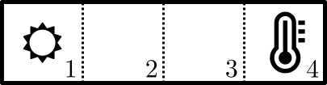

Simplified Model
--------------------------------------------------------------------------------

  - Four cells numbered 1 to 4 are arranged in a row.

  - The first cell has a heat source, the last one a temperature sensor.

  - The heat sink/source is increasing the temperature of its cell 
    of $u$ degrees by second.

  - If the temperature of a cell is $T$ and the one of a neighbor is
    $T_n$, $T$ increases of $T_n - T$ by second.

--------------------------------------------------------------------------------

Given the geometric layout:

  - $d T_1/dt = u + (T_2 - T_1)$

  - $d T_2/dt = (T_1 - T_2) + (T_3 - T_2)$

  - $d T_3/dt = (T_2 - T_3) + (T_4 - T_3)$

  - $d T_4/dt = (T_3 - T_4)$

  - $y = T_4$

--------------------------------------------------------------------------------

Set $x = (T_1, T_2, T_3, T_4)$. 

The model is linear and its standard matrices are:

$$
A = \left[
  \begin{array}{rrrr}
-1 & 1 & 0 & 0   \\
1  & -2 & 1 & 0 \\
0 & 1 & -2 & 1  \\
0 & 0 & 1 & -1 
\end{array}
\right]
$$

--------------------------------------------------------------------------------

$$
B = \left[
  \begin{array}{c}
  1 \\ 0 \\ 0 \\ 0
  \end{array} 
  \right], \;
C = 
\left[ 
\begin{array}{cccc}
0 & 0 & 0 & 1
\end{array}
\right],
\; D = [0]
$$

Nonlinear to Linear
--------------------------------------------------------------------------------

Consider the nonlinear system

  $$
  \begin{array}{ccc}
  \dot{x} &=& f(x, u) \\
        y &=& g(x, u)
  \end{array}
  $$ 

Assume that $x_e$ is an equilibrium when $u=u_e$ (cst):

  $$
  f(x_e, u_e) = 0
  $$

and let 
  
  $$
  y_e = g(x_e, u_e)
  $$

--------------------------------------------------------------------------------

Define the error variables 

  - $\Delta x = x - x_e$, 
  
  - $\Delta u = u - u_e$ and

  - $\Delta y = y - y_e$.

--------------------------------------------------------------------------------

As long as the error variables stay small

  $$
  f(x, u) 
  \simeq
  \overbrace{f(x_e, u_e)}^0 + 
  \frac{\partial f}{\partial x}(x_e, u_e) \Delta x
  + \frac{\partial f}{\partial u}(x_e, u_e) \Delta u
  $$

  $$
  g(x, u) 
  \simeq
  \overbrace{g(x_e, u_e)}^{y_e} + 
  \frac{\partial g}{\partial x}(x_e, u_e) \Delta x
  + \frac{\partial g}{\partial u}(x_e, u_e) \Delta u
  $$

--------------------------------------------------------------------------------

Hence, the error variables satisfy *approximately*

  $$
  \begin{array}{c}
  d(\Delta x)/dt &=& A \Delta x + B \Delta u \\
  \Delta y       &=& C \Delta x + D \Delta u
  \end{array}
  $$

with

  $$
  \left[
  \begin{array}{c|c}
  A &  B \\
  \hline
  C &  D
  \end{array} 
  \right]
  = 
  \left[
  \begin{array}{c|c}
  \frac{\partial f}{\partial x} &  \frac{\partial f}{\partial u} \\
  \hline
  \frac{\partial g}{\partial x} &  \frac{\partial g}{\partial u}
  \end{array} 
  \right](x_e, u_e)
  $$

Asymptotic Stability
--------------------------------------------------------------------------------

The equilibrium $0$ is locally 
asymptotically stable for 

$$
\frac{d \Delta x}{dt} = A \Delta x
$$ 

where $A = \partial f (x_e, u_e) / \partial x.$

$\Rightarrow$

The equilibrium $x_e$ is locally asymptotically 
stable for 

  $$
  \dot{x} = f(x, u_e)
  $$

<i class="fa fa-warning"></i> Converse Result
--------------------------------------------------------------------------------

  - The converse is not true : the nonlinear system may be asymptotically
    stable but not its linearized approximation (e.g. consider $\dot{x} = -x^3$).

  - If we replace local *asymptotic stability* with local *exponential stability*,
    the requirement that locally

    $$
    \|x(t) - x_e\| \leq A e^{-\sigma t} \|x(0) - x_e\|
    $$
    
    for some $A >0$ and $\sigma > 0$, then it works.

<i class="fa fa-eye"></i> -- Linearization
--------------------------------------------------------------------------------

Consider

$$
\dot{x} = -x^2 + u, \; y = x u
$$

If we set $u_e = 1$, the system has an equilibrium at $x_e = 1$
(and also $x_e = -1$ but we focus on the former) and the corresponding
$y$ is $y_e = x_e u_e = 1$.

--------------------------------------------------------------------------------

Around this configuration $(x_e, u_e) = (1, 1)$, we have

$$
\frac{\partial (-x^2+u)}{\partial x} = -2x_e = -2,
\; \frac{\partial (-x^2+u)}{\partial u} = 1,
$$

and

$$
\frac{\partial x u }{\partial x} = u_e = 1,
\; \frac{\partial x u}{\partial u} = x_e = 1.
$$

--------------------------------------------------------------------------------

Thus, the approximate, linearized dynamics around this equilibrium is

$$
\begin{array}{rcr}
d(x-1)/dt &=& -2 (x - 1) + (u - 1) \\
y -1      &=&  (x - 1) + (u - 1)
\end{array}
$$

<i class="fa fa-question-circle-o"></i> -- Linearized Dynamics / Pendulum
--------------------------------------------------------------------------------

A pendulum submitted to a torque $c$ is governed by

$$
m \ell^2 \ddot{\theta} + b \dot{\theta} + m g \ell \sin \theta = c.
$$

We assume that only the angle $\theta$ is effectively measured.

--------------------------------------------------------------------------------

  - What are the function $f$ and $g$ that determine the nonlinear
    dynamics of the pendulum when $x=(\theta, \dot{\theta})$,
    $u=c$ and $y=\theta$?

  - Show that for any angle $\theta_e$ we can find a constant value $c_e$
    of the torque such that $x_e = (\theta_e, 0)$ is an equilibrium.

  - Compute the linearized dynamics of the pendulum around this equilibrium
    and put it in the standard form (compute $A$, $B$, $C$ and $D$).

Internal Dynamics
================================================================================

--------------------------------------------------------------------------------

We study the behavior of the solution

$$
\dot{x} = A x, \; x(0) = x_0 \in \mathbb{R}^n
$$

We try to get some understanding with the simplest cases first.

Scalar Case, Real-Valued
--------------------------------------------------------------------------------

  $$
  \dot{x} = a x
  $$

$a \in \mathbb{R}$, $x(0) = x_0 \in \mathbb{R}$.

--------------------------------------------------------------------------------

**Solution:**
  $$
  x(t) = e^{a t} x_0
  $$

**Proof:**
$$
\frac{d}{dt} e^{at} x_0 = a e^{at} x_0 = a x(t)
$$
and
$$
x(0) = e^{a \times 0} x_0 = x_0.
$$

<i class="fa fa-area-chart"></i> Trajectory
--------------------------------------------------------------------------------
    
    a = 2.0; x0 = 1.0
    figure()
    t = linspace(0.0, 3.0, 1000)
    plot(t, exp(a*t)*x0, "k")
    xlabel("$t$"); ylabel("$x(t)$"); title(f"$a={a}$")
    grid(); axis([0.0, 2.0, 0.0, 10.0])

::: hidden :::::::::::::::::::::::::::::::::::::::::::::::::::::::::::::::::::::

    tight_layout()
    save("images/scalar-LTI-2")

::::::::::::::::::::::::::::::::::::::::::::::::::::::::::::::::::::::::::::::::

::: slides :::::::::::::::::::::::::::::::::::::::::::::::::::::::::::::::::::::

Trajectory
--------------------------------------------------------------------------------

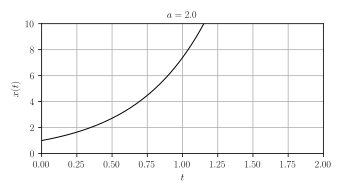

::::::::::::::::::::::::::::::::::::::::::::::::::::::::::::::::::::::::::::::::

<i class="fa fa-area-chart"></i>
--------------------------------------------------------------------------------

    figure()
    plot(real(a), imag(a), "x", color="k", ms=10.0)
    gca().set_aspect(1.0)
    xlim(-3,3); ylim(-3,3); 
    plot([-3,3], [0,0], "k")
    plot([0, 0], [-3, 3], "k")
    xticks([-2,-1,0,1,2]); yticks([-2,-1,0,1,2])
    title(f"$a={a}$")
    grid(True)

::: hidden :::::::::::::::::::::::::::::::::::::::::::::::::::::::::::::::::::::

    tight_layout()
    
    save("images/scalar-LTI-2-poles")

::::::::::::::::::::::::::::::::::::::::::::::::::::::::::::::::::::::::::::::::

::: slides :::::::::::::::::::::::::::::::::::::::::::::::::::::::::::::::::::::

--------------------------------------------------------------------------------

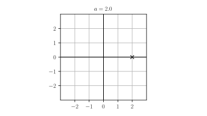

::::::::::::::::::::::::::::::::::::::::::::::::::::::::::::::::::::::::::::::::

<i class="fa fa-area-chart"></i>
--------------------------------------------------------------------------------
    
    a = 1.0; x0 = 1.0
    figure()
    t = linspace(0.0, 3.0, 1000)
    plot(t, exp(a*t)*x0, "k")
    xlabel("$t$"); ylabel("$x(t)$"); title(f"$a={a}$")
    grid(); axis([0.0, 2.0, 0.0, 10.0])

::: hidden :::::::::::::::::::::::::::::::::::::::::::::::::::::::::::::::::::::

    tight_layout()
    save("images/scalar-LTI-1")

::::::::::::::::::::::::::::::::::::::::::::::::::::::::::::::::::::::::::::::::

::: slides :::::::::::::::::::::::::::::::::::::::::::::::::::::::::::::::::::::

--------------------------------------------------------------------------------

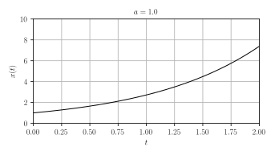

::::::::::::::::::::::::::::::::::::::::::::::::::::::::::::::::::::::::::::::::

<i class="fa fa-area-chart"></i>
--------------------------------------------------------------------------------

    figure()
    plot(real(a), imag(a), "x", color="k", ms=10.0)
    gca().set_aspect(1.0)
    xlim(-3,3); ylim(-3,3); 
    plot([-3,3], [0,0], "k")
    plot([0, 0], [-3, 3], "k")
    xticks([-2,-1,0,1,2]); yticks([-2,-1,0,1,2])
    title(f"$a={a}$")
    grid(True)

::: hidden :::::::::::::::::::::::::::::::::::::::::::::::::::::::::::::::::::::

    tight_layout()
    
    save("images/scalar-LTI-1-poles")

::::::::::::::::::::::::::::::::::::::::::::::::::::::::::::::::::::::::::::::::

::: slides :::::::::::::::::::::::::::::::::::::::::::::::::::::::::::::::::::::

--------------------------------------------------------------------------------

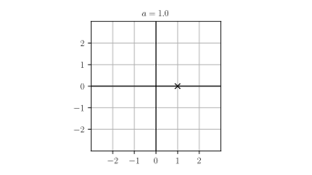

::::::::::::::::::::::::::::::::::::::::::::::::::::::::::::::::::::::::::::::::

<i class="fa fa-area-chart"></i>
--------------------------------------------------------------------------------
    
    a = 0.0; x0 = 1.0
    figure()
    t = linspace(0.0, 3.0, 1000)
    plot(t, exp(a*t)*x0, "k")
    xlabel("$t$"); ylabel("$x(t)$"); title(f"$a={a}$")
    grid(); axis([0.0, 2.0, 0.0, 10.0])

::: hidden :::::::::::::::::::::::::::::::::::::::::::::::::::::::::::::::::::::

    tight_layout()
    save("images/scalar-LTI-0")

::::::::::::::::::::::::::::::::::::::::::::::::::::::::::::::::::::::::::::::::

::: slides :::::::::::::::::::::::::::::::::::::::::::::::::::::::::::::::::::::

--------------------------------------------------------------------------------

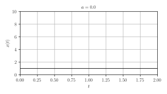

::::::::::::::::::::::::::::::::::::::::::::::::::::::::::::::::::::::::::::::::

<i class="fa fa-area-chart"></i>
--------------------------------------------------------------------------------

    figure()
    plot(real(a), imag(a), "x", color="k", ms=10.0)
    gca().set_aspect(1.0)
    xlim(-3,3); ylim(-3,3); 
    plot([-3,3], [0,0], "k")
    plot([0, 0], [-3, 3], "k")
    xticks([-2,-1,0,1,2]); yticks([-2,-1,0,1,2])
    title(f"$a={a}$")
    grid(True)

::: hidden :::::::::::::::::::::::::::::::::::::::::::::::::::::::::::::::::::::

    tight_layout()
    
    save("images/scalar-LTI-0-poles")

::::::::::::::::::::::::::::::::::::::::::::::::::::::::::::::::::::::::::::::::

::: slides :::::::::::::::::::::::::::::::::::::::::::::::::::::::::::::::::::::

--------------------------------------------------------------------------------

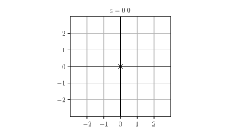

::::::::::::::::::::::::::::::::::::::::::::::::::::::::::::::::::::::::::::::::

<i class="fa fa-area-chart"></i>
--------------------------------------------------------------------------------

    a = -1.0; x0 = 1.0
    figure()
    t = linspace(0.0, 3.0, 1000)
    plot(t, exp(a*t)*x0, "k")
    xlabel("$t$"); ylabel("$x(t)$"); title(f"$a={a}$")
    grid(); axis([0.0, 2.0, 0.0, 10.0])

::: hidden :::::::::::::::::::::::::::::::::::::::::::::::::::::::::::::::::::::

    tight_layout()
    save("images/scalar-LTI-m1")

::::::::::::::::::::::::::::::::::::::::::::::::::::::::::::::::::::::::::::::::

::: slides :::::::::::::::::::::::::::::::::::::::::::::::::::::::::::::::::::::

--------------------------------------------------------------------------------

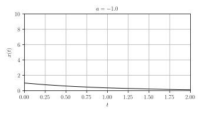

::::::::::::::::::::::::::::::::::::::::::::::::::::::::::::::::::::::::::::::::

<i class="fa fa-area-chart"></i>
--------------------------------------------------------------------------------

    figure()
    plot(real(a), imag(a), "x", color="k", ms=10.0)
    gca().set_aspect(1.0)
    xlim(-3,3); ylim(-3,3); 
    plot([-3,3], [0,0], "k")
    plot([0, 0], [-3, 3], "k")
    xticks([-2,-1,0,1,2]); yticks([-2,-1,0,1,2])
    title(f"$a={a}$")
    grid(True)

::: hidden :::::::::::::::::::::::::::::::::::::::::::::::::::::::::::::::::::::

    tight_layout()
    
    save("images/scalar-LTI-m1-poles")

::::::::::::::::::::::::::::::::::::::::::::::::::::::::::::::::::::::::::::::::

::: slides :::::::::::::::::::::::::::::::::::::::::::::::::::::::::::::::::::::

--------------------------------------------------------------------------------

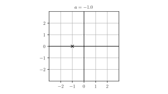

::::::::::::::::::::::::::::::::::::::::::::::::::::::::::::::::::::::::::::::::

<i class="fa fa-area-chart"></i>
--------------------------------------------------------------------------------
    
    a = -2.0; x0 = 1.0
    figure()
    t = linspace(0.0, 3.0, 1000)
    plot(t, exp(a*t)*x0, "k")
    xlabel("$t$"); ylabel("$x(t)$"); title(f"$a={a}$")
    grid(); axis([0.0, 2.0, 0.0, 10.0])

::: hidden :::::::::::::::::::::::::::::::::::::::::::::::::::::::::::::::::::::

    tight_layout()
    save("images/scalar-LTI-m2")

::::::::::::::::::::::::::::::::::::::::::::::::::::::::::::::::::::::::::::::::

::: slides :::::::::::::::::::::::::::::::::::::::::::::::::::::::::::::::::::::

--------------------------------------------------------------------------------

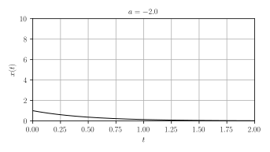

::::::::::::::::::::::::::::::::::::::::::::::::::::::::::::::::::::::::::::::::

<i class="fa fa-area-chart"></i>
--------------------------------------------------------------------------------

    figure()
    plot(real(a), imag(a), "x", color="k", ms=10.0)
    gca().set_aspect(1.0)
    xlim(-3,3); ylim(-3,3); 
    plot([-3,3], [0,0], "k")
    plot([0, 0], [-3, 3], "k")
    xticks([-2,-1,0,1,2]); yticks([-2,-1,0,1,2])
    title(f"$a={a}$")
    grid(True)

::: hidden :::::::::::::::::::::::::::::::::::::::::::::::::::::::::::::::::::::

    tight_layout()
    
    save("images/scalar-LTI-m2-poles")

::::::::::::::::::::::::::::::::::::::::::::::::::::::::::::::::::::::::::::::::

::: slides :::::::::::::::::::::::::::::::::::::::::::::::::::::::::::::::::::::

--------------------------------------------------------------------------------

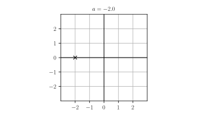

::::::::::::::::::::::::::::::::::::::::::::::::::::::::::::::::::::::::::::::::

Analysis
--------------------------------------------------------------------------------

  - The origin is globally asymptotically stable when $a < 0.0$:  
    $a$ is in the open left-hand plane,

  - In this case, define the time constant $\tau = - 1 / a$:

    $$
    x(t) = e^{at} x_0 = e^{-t/\tau} x_0
    $$

--------------------------------------------------------------------------------

$\tau$ controls the time it take for the solution 
to (almost) reach to the origin:

  - when $t = \tau$, $|x(t)|$ is $\simeq$ $1/3$ of $|x_0|$;  

  - when $t = 3 \tau$, $|x(t)|$ is $\simeq$ $5 \%$ of $|x_0|$.

Vector Case, Diagonal, Real-Valued
--------------------------------------------------------------------------------

$$
\dot{x}_1 = a_1 x_1, \; x_1(0) = x_{10}
$$

$$
\dot{x}_2 = a_2 x_2, \; x_2(0) = x_{20}
$$

i.e.

$$
A = \left[
\begin{array}{cc}
a_1 &   0 \\
  0 & a_2
\end{array}
\right]
$$

--------------------------------------------------------------------------------

**Solution:** by linearity

$$
x(t) =   e^{a_1 t} \left[\begin{array}{c} x_{10} \\ 0 \end{array}\right] 
       + e^{a_2 t} \left[\begin{array}{c} 0 \\ x_{20} \end{array}\right] 
$$

<i class="fa fa-area-chart"></i>
--------------------------------------------------------------------------------

    a1 = -1.0; a2 = 2.0; x10 = x20 = 1.0
    figure()
    t = linspace(0.0, 3.0, 1000)
    x1 = exp(a1*t)*x10; x2 = exp(a2*t)*x20
    xn = sqrt(x1**2 + x2**2)
    plot(t, xn , "k")
    plot(t, x1, "k--")
    plot(t, x2 , "k--")
    xlabel("$t$"); ylabel("$\|x(t)\|$"); title(f"$a_1={a1}, \; a_2={a2}$")
    grid(); axis([0.0, 2.0, 0.0, 10.0])

::: hidden :::::::::::::::::::::::::::::::::::::::::::::::::::::::::::::::::::::

    tight_layout()
    save("images/scalar-LTI-m1p2")

::::::::::::::::::::::::::::::::::::::::::::::::::::::::::::::::::::::::::::::::

::: slides :::::::::::::::::::::::::::::::::::::::::::::::::::::::::::::::::::::

--------------------------------------------------------------------------------

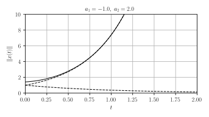

::::::::::::::::::::::::::::::::::::::::::::::::::::::::::::::::::::::::::::::::

<i class="fa fa-area-chart"></i>
--------------------------------------------------------------------------------

    figure()
    plot(real(a1), imag(a1), "x", color="k", ms=10.0)
    plot(real(a2), imag(a2), "x", color="k", ms=10.0)
    gca().set_aspect(1.0)
    xlim(-3,3); ylim(-3,3); 
    plot([-3,3], [0,0], "k")
    plot([0, 0], [-3, 3], "k")
    xticks([-2,-1,0,1,2]); yticks([-2,-1,0,1,2])
    title(f"$a_1={a1}, \; a_2={a2}$")
    grid(True)

::: hidden :::::::::::::::::::::::::::::::::::::::::::::::::::::::::::::::::::::

    tight_layout()
    
    save("images/scalar-LTI-m1p2-poles")

::::::::::::::::::::::::::::::::::::::::::::::::::::::::::::::::::::::::::::::::

::: slides :::::::::::::::::::::::::::::::::::::::::::::::::::::::::::::::::::::

--------------------------------------------------------------------------------

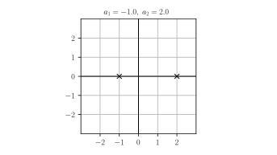

::::::::::::::::::::::::::::::::::::::::::::::::::::::::::::::::::::::::::::::::

<i class="fa fa-area-chart"></i>
--------------------------------------------------------------------------------

    a1 = -1.0; a2 = -2.0; x10 = x20 = 1.0
    figure()
    t = linspace(0.0, 3.0, 1000)
    x1 = exp(a1*t)*x10; x2 = exp(a2*t)*x20
    xn = sqrt(x1**2 + x2**2)
    plot(t, xn , "k")
    plot(t, x1, "k--")
    plot(t, x2 , "k--")
    xlabel("$t$"); ylabel("$\|x(t)\|$"); title(f"$a_1={a1}, \; a_2={a2}$")
    grid(); axis([0.0, 2.0, 0.0, 10.0])

::: hidden :::::::::::::::::::::::::::::::::::::::::::::::::::::::::::::::::::::

    tight_layout()
    save("images/scalar-LTI-m1m2")

::::::::::::::::::::::::::::::::::::::::::::::::::::::::::::::::::::::::::::::::

::: slides :::::::::::::::::::::::::::::::::::::::::::::::::::::::::::::::::::::

--------------------------------------------------------------------------------

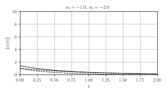

::::::::::::::::::::::::::::::::::::::::::::::::::::::::::::::::::::::::::::::::

<i class="fa fa-area-chart"></i>
--------------------------------------------------------------------------------

    figure()
    plot(real(a1), imag(a1), "x", color="k", ms=10.0)
    plot(real(a2), imag(a2), "x", color="k", ms=10.0)
    gca().set_aspect(1.0)
    xlim(-3,3); ylim(-3,3); 
    plot([-3,3], [0,0], "k")
    plot([0, 0], [-3, 3], "k")
    xticks([-2,-1,0,1,2]); yticks([-2,-1,0,1,2])
    title(f"$a_1={a1}, \; a_2={a2}$")
    grid(True)

::: hidden :::::::::::::::::::::::::::::::::::::::::::::::::::::::::::::::::::::

    tight_layout()
    
    save("images/scalar-LTI-m1m2-poles")

::::::::::::::::::::::::::::::::::::::::::::::::::::::::::::::::::::::::::::::::

::: slides :::::::::::::::::::::::::::::::::::::::::::::::::::::::::::::::::::::

--------------------------------------------------------------------------------

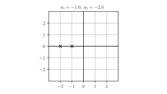

::::::::::::::::::::::::::::::::::::::::::::::::::::::::::::::::::::::::::::::::

Analysis
--------------------------------------------------------------------------------

  - The rightmost $a_i$ determines the asymptotic behavior,

  - The origin is globally asymptotically stable 
    only when every $a_i$ is in the open left-hand plane.

Scalar Case, Complex-Valued
--------------------------------------------------------------------------------

  $$
  \dot{x} = a x
  $$

$a \in \mathbb{C}$, $x(0) = x_0 \in \mathbb{C}$.

--------------------------------------------------------------------------------

**Solution:** formally, the same old solution

$$
x(t) = e^{at} x_0
$$

But now, $x(t) \in \mathbb{C}$:

if $a = \sigma + i \omega$ and $x_0 = |x_0| e^{i \angle x_0}$

$$
|x(t)| = |x_0| e^{\sigma t} \, \mbox{ and } \, \angle x(t) = \angle x_0 + \omega t.
$$

<i class="fa fa-area-chart"></i>
--------------------------------------------------------------------------------

    a = 1.0j; x0=1.0
    figure()
    t = linspace(0.0, 20.0, 1000)
    plot(t, real(exp(a*t)*x0), label="$\mathrm{Re}(x(t))$")
    plot(t, imag(exp(a*t)*x0), label="$\mathrm{Im}(x(t))$")
    xlabel("$t$")
    legend(); grid()

::: hidden :::::::::::::::::::::::::::::::::::::::::::::::::::::::::::::::::::::

    tight_layout()
    save("images/scalar-LTI-alt-1")

::::::::::::::::::::::::::::::::::::::::::::::::::::::::::::::::::::::::::::::::

::: slides :::::::::::::::::::::::::::::::::::::::::::::::::::::::::::::::::::::

--------------------------------------------------------------------------------

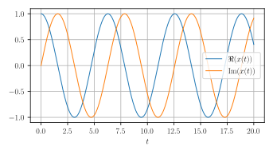

::::::::::::::::::::::::::::::::::::::::::::::::::::::::::::::::::::::::::::::::

--------------------------------------------------------------------------------

    fig = figure()
    ax = fig.add_subplot(111, projection="3d")
    zticks = ax.set_zticks
    ax.plot(t, real(exp(a*t)*x0), imag(exp(a*t)*x0))
    xticks([0.0, 20.0]); yticks([]); zticks([])
    ax.set_xlabel("$t$")
    ax.set_ylabel("$\mathrm{Re}(x(t))$")
    ax.set_zlabel("$\mathrm{Im}(x(t))$")

::: hidden :::::::::::::::::::::::::::::::::::::::::::::::::::::::::::::::::::::

    tight_layout()
    save("images/scalar-LTI-3d")

::::::::::::::::::::::::::::::::::::::::::::::::::::::::::::::::::::::::::::::::

::: slides :::::::::::::::::::::::::::::::::::::::::::::::::::::::::::::::::::::

--------------------------------------------------------------------------------

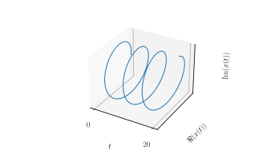

::::::::::::::::::::::::::::::::::::::::::::::::::::::::::::::::::::::::::::::::

<i class="fa fa-area-chart"></i>
--------------------------------------------------------------------------------

    figure()
    plot(real(a), imag(a), "x", color="k", ms=10.0)
    gca().set_aspect(1.0)
    xlim(-3,3); ylim(-3,3); 
    plot([-3,3], [0,0], "k")
    plot([0, 0], [-3, 3], "k")
    xticks([-2,-1,0,1,2]); yticks([-2,-1,0,1,2])
    title(f"$a={a}$")
    grid(True)

::: hidden :::::::::::::::::::::::::::::::::::::::::::::::::::::::::::::::::::::

    tight_layout()
    
    save("images/scalar-LTI-1j-poles")

::::::::::::::::::::::::::::::::::::::::::::::::::::::::::::::::::::::::::::::::

::: slides :::::::::::::::::::::::::::::::::::::::::::::::::::::::::::::::::::::

--------------------------------------------------------------------------------

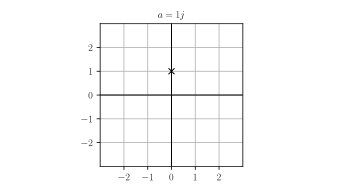

::::::::::::::::::::::::::::::::::::::::::::::::::::::::::::::::::::::::::::::::

<i class="fa fa-area-chart"></i>
--------------------------------------------------------------------------------

    a = -0.5 + 1.0j; x0=1.0
    figure()
    t = linspace(0.0, 20.0, 1000)
    plot(t, real(exp(a*t)*x0), label="$\mathrm{Re}(x(t))$")
    plot(t, imag(exp(a*t)*x0), label="$\mathrm{Im}(x(t))$")
    xlabel("$t$")
    legend(); grid()

::: hidden :::::::::::::::::::::::::::::::::::::::::::::::::::::::::::::::::::::

    tight_layout()
    save("images/scalar-LTI-alt-2")

::::::::::::::::::::::::::::::::::::::::::::::::::::::::::::::::::::::::::::::::

::: slides :::::::::::::::::::::::::::::::::::::::::::::::::::::::::::::::::::::

--------------------------------------------------------------------------------

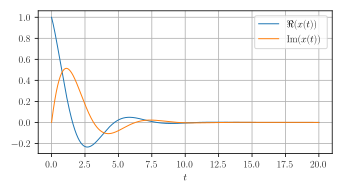

::::::::::::::::::::::::::::::::::::::::::::::::::::::::::::::::::::::::::::::::

<i class="fa fa-area-chart"></i>
--------------------------------------------------------------------------------

    fig = figure()
    ax = fig.add_subplot(111, projection="3d")
    zticks = ax.set_zticks
    ax.plot(t, real(exp(a*t)*x0), imag(exp(a*t)*x0))
    xticks([0.0, 20.0]); yticks([]); zticks([])
    ax.set_xlabel("$t$")
    ax.set_ylabel("$\mathrm{Re}(x(t))$")
    ax.set_zlabel("$\mathrm{Im}(x(t))$")

::: hidden :::::::::::::::::::::::::::::::::::::::::::::::::::::::::::::::::::::

    tight_layout()
    save("images/scalar-LTI-3d-2")

::::::::::::::::::::::::::::::::::::::::::::::::::::::::::::::::::::::::::::::::

::: slides :::::::::::::::::::::::::::::::::::::::::::::::::::::::::::::::::::::

--------------------------------------------------------------------------------

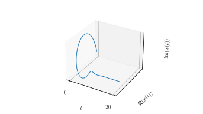

::::::::::::::::::::::::::::::::::::::::::::::::::::::::::::::::::::::::::::::::

<i class="fa fa-area-chart"></i>
--------------------------------------------------------------------------------

    figure()
    plot(real(a), imag(a), "x", color="k", ms=10.0)
    gca().set_aspect(1.0)
    xlim(-3,3); ylim(-3,3); 
    plot([-3,3], [0,0], "k")
    plot([0, 0], [-3, 3], "k")
    xticks([-2,-1,0,1,2]); yticks([-2,-1,0,1,2])
    title(f"$a={a}$")
    grid(True)

::: hidden :::::::::::::::::::::::::::::::::::::::::::::::::::::::::::::::::::::

    tight_layout()
    
    save("images/scalar-LTI-m11j-poles")

::::::::::::::::::::::::::::::::::::::::::::::::::::::::::::::::::::::::::::::::

::: slides :::::::::::::::::::::::::::::::::::::::::::::::::::::::::::::::::::::

--------------------------------------------------------------------------------

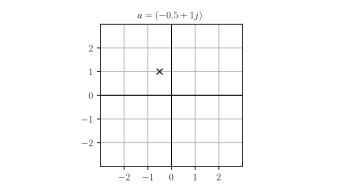

::::::::::::::::::::::::::::::::::::::::::::::::::::::::::::::::::::::::::::::::

Analysis
--------------------------------------------------------------------------------

  - the origin is globally asymptotically stable if $a$ is in the open left-hand plane:
    $$\mathrm{Re} (a) < 0$$

  - if $a= \sigma + i \omega$,

      - $\tau = -1 /\sigma$ is the time constant related of the speed of convergence,

      - $\omega$ the (rotational) frequency of the (damped) oscillations.

--------------------------------------------------------------------------------

Only one step left before the (almost) general case ...

Exponential Matrix
--------------------------------------------------------------------------------

If $M \in \mathbb{C}^{n \times n}$,
the **exponential** is defined as:

  $$
  e^{M} = \sum_{i=0}^{+\infty} \frac{M^n}{n !} \in \mathbb{C}^{n \times n}
  $$

--------------------------------------------------------------------------------

### <i class="fa fa-warning"></i>

The exponential of a matrix $M$ is *not* 
the matrix with elements $e^{M_{ij}}$ (the elementwise exponential).

  - elementwise exponential: **`exp`** (`numpy` module),

  - exponential: **`expm`** (`scipy.linalg` module).

<i class="fa fa-question-circle-o"></i> Exponential Matrix
--------------------------------------------------------------------------------

Let 
  
  $$
  M = 
  \left[
  \begin{array}{cc}
  0 & 1 \\
  1 & 0
  \end{array}
  \right]
  $$

  - [<i class="fa fa-superscript"></i>] Compute the exponential of $M$.

    <i class="fa fa-key"></i> **Hint:**
    $\cosh x = \frac{e^x + e^{-x}}{2},$
    $\sinh x = \frac{e^x - e^{-x}}{2}.$

  - [<i class="fa fa-flask"></i>] Check the results with `expm`.

--------------------------------------------------------------------------------

Note that

  $$
  \begin{align}
  \frac{d}{dt} e^{A t} &= \frac{d}{dt} \sum_{n=0}^{+\infty} \frac{A^n}{n!} t^n \\ 
  &= \sum_{n=1}^{+\infty} \frac{A^{n}}{(n-1)!} t^{n-1} \\
  &= A \sum_{n=1}^{+\infty} \frac{A^{n-1}}{(n-1)!} t^{n-1} 
  = A e^{A t}
  \end{align}
  $$

--------------------------------------------------------------------------------

Thus, for any $A \in \mathbb{C}^{n\times n}$ and $x_0 \in \mathbb{C}^n$, 

  $$
  \frac{d}{dt} (e^{A t} x_0) 
  = A (e^{At} x_0)
  $$

Internal Dynamics
--------------------------------------------------------------------------------

The solution of

  $$
  \dot{x} = A x\; \mbox{ and } \; x(0) = x_0
  $$

is

  $$
  x(t) = e^{A t} x_0.
  $$

Stability Criteria
--------------------------------------------------------------------------------

Let $A \in \mathbb{C}^{n \times n}$.

The origin of $\dot{x} = A x$ is globally asymptotically stable 

$\Longleftrightarrow$
   
all eigenvalues of $A$ have a negative real part.

<i class="fa fa-question-circle-o"></i> G.A.S. $\Leftrightarrow$ L.A.
--------------------------------------------------------------------------------

Show that for a linear systems $\dot{x} = Ax$, it is enough that the origin
is locally attractive for the system to be globally asymptotically stable.

--------------------------------------------------------------------------------

### Why does this criteria work?

Assume that $A$ is diagonalizable with eigenvalues 
$\{\lambda_1, \dots, \lambda_n\}$.

(Very likely unless $A$ has some special structure)

--------------------------------------------------------------------------------

Then, there is an invertible matrix $P \in \mathbb{C}^{n \times n}$ such that

  $$
  P^{-1} A P = \mathrm{diag}(\lambda_1, \dots, \lambda_n) =
  \left[
  \begin{array}{cccc}
  \lambda_1 & 0         & \cdots & 0 \\
  0         & \lambda_2 & \cdots & 0 \\
  \vdots    & \vdots    & \vdots & \vdots \\
  0         & \cdots    & \cdots & \lambda_n
  \end{array}
  \right] 
  $$

--------------------------------------------------------------------------------

Thus, if $y = P^{-1} x$, $\dot{x} = A x$ is equivalent to

  $$
  \left|
  \begin{array}{ccc}
  \dot{y}_1 &=& \lambda_1 y_1 \\
  \dot{y}_2 &=& \lambda_2 y_2 \\
  \vdots &=& \vdots \\
  \dot{y}_n &=& \lambda_n y_n \\
  \end{array}
  \right.
  $$

The system is G.A.S. iff each component of the system is, 
which holds iff $\mathrm{Re} \lambda_i < 0$ for each $i$.

<i class="fa fa-question-circle-o"></i> Stability / 2nd-order system
--------------------------------------------------------------------------------

Consider the scalar ODE 

  $$
  \ddot{x} + k x = 0, \; \mbox{ with } k > 0
  $$

  - [<i class="fa fa-superscript"></i>] 
    Determine the representation of this system 
    as a first-order ODE with state $(x, \dot{x})$.

  - [<i class="fa fa-lightbulb-o"></i>, <i class="fa fa-superscript"></i>] 
    Is this system asymptotically stable? 
    
--------------------------------------------------------------------------------

  - [<i class="fa fa-lightbulb-o"></i>, <i class="fa fa-superscript"></i>] 
    If its solutions oscillate,
    determine its (rotational) frequency $\omega$?

  - [<i class="fa fa-lightbulb-o"></i>, <i class="fa fa-superscript"></i>] 
    Characterize the asymptotic behavior of $x(t)$ when
    $\ddot{x} + b \dot{x} + k x = 0$ for some $b>0$.

<i class="fa fa-question-circle-o"></i> Stability / Integrators
--------------------------------------------------------------------------------

Consider the system

  $$
  \dot{x} = J x 
  \; \mbox{ with } \; 
  J = 
  \left[
  \begin{array}{cccc}
  0 & 1 & 0 & \dots & 0 \\
  0 & 0 & 1 & \dots & 0 \\
  \vdots & \vdots & \vdots & \vdots & \vdots \\
  0 & 0 & 0 & \dots & 1 \\
  0 & 0 & 0 & \dots & 0
  \end{array}
  \right]
  $$

--------------------------------------------------------------------------------

  - [<i class="fa fa-lightbulb-o"></i>, <i class="fa fa-superscript"></i>] 
    Compute the solution when 

      $$
      x(0) =
      \left[
      \begin{array}{c}
      0 \\
      \vdots \\
      0 \\
      1
      \end{array}
      \right],$$

    then for any initial condition.

--------------------------------------------------------------------------------

  - [<i class="fa fa-lightbulb-o"></i>, <i class="fa fa-superscript"></i>] 
    Same questions when $\dot{x} = (\lambda I + J)x$ 
    for some $\lambda \in \mathbb{C}$. 

  - [<i class="fa fa-lightbulb-o"></i>] Is the system asymptotically stable ? 
    Why does it matter in general?

I/O Behavior
================================================================================

Context
--------------------------------------------------------------------------------

  - Assume that the system is "initially at rest":

    $$
    x(0) = 0
    $$

  - Forget about the state $x(t)$ (may be unknown)

  - Study the input/output (I/O) relationship:

    $$
    u \to y
    $$

--------------------------------------------------------------------------------

In this context, we have:

  $$
  y(t) = \int_0^{t} C e^{A(t-\tau)} B u(\tau) \, d\tau + D u(t)
  $$

Causal Signals
--------------------------------------------------------------------------------

   - extend $u(t)$ and $y(t)$ by $0$ when $t<0$ (as **causal signals**).

   - introduce the **Heaviside function** defined by

     $$
     e(t) = \left|
     \begin{array}{c}
     1 & \mbox{if } \; t\geq 0, \\
     0 & \mbox{if } \; t < 0.
     \end{array}
     \right.
     $$

Impulse Response
--------------------------------------------------------------------------------

The system **impulse response** is defined by:

$$
H(t) = (C e^{At} B) \times e(t) + D \delta(t) \in \mathbb{R}^{p \times m}
$$

<i class="fa fa-sticky-note"></i> works for general or **MIMO** systems.  
MIMO = multiple-input & multiple-output systems.

<i class="fa fa-sticky-note"></i> $\delta(t)$ is the **unit impulse**, 
we'll get back to it (in the meantime, you may assume that $D=0$).

SISO Systems
--------------------------------------------------------------------------------

When 

$$p = m = 1$$ 

(single-input & single-output or **SISO** systems),

the $1 \times 1$ matrix $H(t)$ is identified with a scalar $h(t)$:

$$
H(t) = [h(t)]
$$

--------------------------------------------------------------------------------

Then, we have:

  $$
  y(t) = \int_{-\infty}^{+\infty} H(t - \tau) u(\tau) \, d\tau
  $$

and denote $\ast$ this operation
between $H$ and $u$:

  $$
  y(t) = (H \ast u) (t)
  $$

It's called a **convolution**.

<i class="fa fa-eye"></i> Impulse Response
--------------------------------------------------------------------------------

Consider the SISO system
  
$$
\left| 
\begin{array}{ccl}
\dot{x} &=& ax + u \\
y &=& x \\
\end{array}
\right.
$$

where $a \neq 0$.

--------------------------------------------------------------------------------

We have

$$
\begin{split}
H(t) &= (C e^{At} B) \times e(t) + D \delta(t)\\
     &= [1]e^{[a]t} [1] e(t) + [0] \delta(t) \\
     &= [e(t)e^{at}]
\end{split}
$$

--------------------------------------------------------------------------------

When $u(t) = e(t)$ for example,

$$
\begin{split}
y(t) 
  &= \int_{-\infty}^{+\infty} e(t - \tau)e^{a(t-\tau)} e(\tau) \, d\tau \\
  &= \int_{0}^{t} e^{a(t- \tau)} \, d\tau \\
  &= \int_{0}^{t} e^{a \tau} \, d\tau  \\
  &= \frac{1}{a} \left(e^{a t} - 1 \right)
\end{split} 
$$

--------------------------------------------------------------------------------

<i class="fa fa-question-circle-o"></i> Impulse Response / Integrator
--------------------------------------------------------------------------------

  - [<i class="fa fa-superscript"></i>] Compute the impulse response of the 
    system
  
    $$
    \left| 
    \begin{array}{ccc}
    \dot{x} &=& u \\
    y &=& x \\
    \end{array}
    \right.
    $$

where $u \in \mathbb{R}$, $x \in \mathbb{R}$ and $y \in \mathbb{R}$.

<i class="fa fa-question-circle-o"></i> Impulse Response / Double Integrator
--------------------------------------------------------------------------------

  - [<i class="fa fa-superscript"></i>] Compute the impulse response of the 
    system
  
    $$
    \left| 
    \begin{array}{ccc}
    \dot{x}_1 &=& x_2 \\
    \dot{x}_2 &=& u \\
    y &=& x_1 \\
    \end{array}
    \right.
    $$

    where $u \in \mathbb{R}$, $x=(x_1, x_2) \in \mathbb{R}^2$ and $y \in \mathbb{R}$.

<i class="fa fa-question-circle-o"></i> Impulse Response / Gain
--------------------------------------------------------------------------------

  - [<i class="fa fa-superscript"></i>] Compute the impulse response of the 
    system
  
    $$
    y = K u
    $$

    where $u \in \mathbb{R}^m$, $y \in \mathbb{R}^p$ and 
    $K \in \mathbb{R}^{p \times m}$.

<i class="fa fa-question-circle-o"></i> Impulse Response / MIMO System
--------------------------------------------------------------------------------

 -  [<i class="fa fa-superscript"></i>] 
    Find a linear system with matrices $A$, $B$, $C$, $D$ 
    whose impulse response is

  $$
  H(t) = 
  \left[
  \begin{array}{cc}
  e^{t} e(t) & e^{-t} e(t)
  \end{array}
  \right]
  $$

 -  [<i class="fa fa-superscript"></i>] 
    Is there another set of matrices $A$, $B$, $C$, $D$ with the same
    impulse response? With a matrix $A$ of a different size?

Laplace Transform
--------------------------------------------------------------------------------

Associate to a scalar signal $x(t) \in \mathbb{R}$, 
$t\in \mathbb{R}$,
the function of a complex argument $s \in \mathbb{C}$:

$$
x(s) = \int_{-\infty}^{+\infty} x(t) e^{-st} \, dt.
$$

defined when $\mathrm{Re} \, (s) > \sigma$ if $\|x(t)\| \leq K e^{\sigma t}$.

<i class="fa fa-warning"></i> Notation
--------------------------------------------------------------------------------

We use the same symbol (here "$x$") to denote: 

  - a signal $x(t)$ and

  - its Laplace transform $x(s)$
 
They are two equivalent representations of the same "object", 
but different mathematical "functions". 

If you fear some ambiguity, use named variables, e.g.:

  $$
  x(t=1) \, \mbox{ or } \, x(s=1) \, \mbox{ instead of } \, x(1).
  $$

Vector/Matrix-Valued Signals
--------------------------------------------------------------------------------

The Laplace transform 

  - of a vector-valued signal $x(t) \in \mathbb{R}^n$ or

  - of a matrix-valued signals $X(t) \in \mathbb{R}^{m \times n}$ 
  
are computed elementwise.

--------------------------------------------------------------------------------

  $$
  x_{i}(s) = \int_{-\infty}^{+\infty} x_{i}(t) e^{-st} \, dt.
  $$

  $$
  X_{ij}(s) = \int_{-\infty}^{+\infty} X_{ij}(t) e^{-st} \, dt.
  $$

Rational & Causal Signals
--------------------------------------------------------------------------------

We will only deal with **rational & causal** signals:

  $$
  x(t) = \left(\sum_{\lambda \in \Lambda} p_{\lambda}(t) e^{\lambda t} \right) e(t)
  $$

where: 

  - $\Lambda$ is a finite subset of $\mathbb{C}$,

  - for every $\lambda \in \Lambda$, $p_{\lambda}(t)$ is a polynomial in $t$.

--------------------------------------------------------------------------------

  - Such signals are **causal** since 
  
    $x(t) = 0$ when $t < 0$. 

    <i class="fa fa-sticky-note"></i> Causality $\Leftrightarrow$ $\deg n(s) \leq \deg d(s)$.

  - They are **rational** since

      $$
      x(s) = \frac{n(s)}{d(s)}
      $$

    where $n(s)$ and $d(s)$ are polynomials.

<i class="fa fa-eye"></i> Laplace Transform / Exponential
--------------------------------------------------------------------------------

Set $x(t) = e(t) e^{a t}$

$$
\begin{split}
x(s) &= \int_0^{+\infty} e^{at} e^{-s t} \, dt = \int_0^{+\infty} e^{(a-s) t} \, dt \\
&= \left[\frac{e^{(a-s) t}}{a-s} \right]^{+\infty}_0 = \frac{1}{s-a}
\end{split}
$$

(If $\mathrm{Re} (s) \geq  \mathrm{Re} \, (a) +\epsilon$, then
$|e^{(a-s)t}| \leq e^{-\epsilon t}$)

Symbolic Computations
--------------------------------------------------------------------------------

    import sympy
    from sympy.abc import t, s, a
    from sympy.integrals.transforms import laplace_transform    
    def L(f):
        return laplace_transform(f, t, s)[0]

--------------------------------------------------------------------------------

    xt = sympy.exp(a*t)
    xs = L(xt) # 1/(-a + s)

<i class="fa fa-question-circle-o"></i> Laplace Transform / Ramp
--------------------------------------------------------------------------------

Compute the Laplace Transform of

$$
x(t) = t e(t)
$$

Convolution & Laplace 
--------------------------------------------------------------------------------

Let $H(t)$ be the impulse response of a system.

Its Laplace transform $H(s)$ is called the system **transfer function**.

For LTI systems in standard form, we have

$$
H(s) = C [sI - A]^{-1} B + D
$$

Operational Calculus
--------------------------------------------------------------------------------

The Laplace transform turns convolution into products:

  $$
  y(t) = (H \ast u)(t)
  \; \Longleftrightarrow \;
  y(s) = H(s) \times u(s)
  $$

Graphical Language
--------------------------------------------------------------------------------

Control engineers used *block diagrams* to describe (combinations of) 
dynamical systems, with

  - "boxes" to determine the relation between input signals and output signals and

  - "wires" to route output signals to inputs signals.

<i class="fa fa-eye"></i> Block-Diagram / Feedback
--------------------------------------------------------------------------------

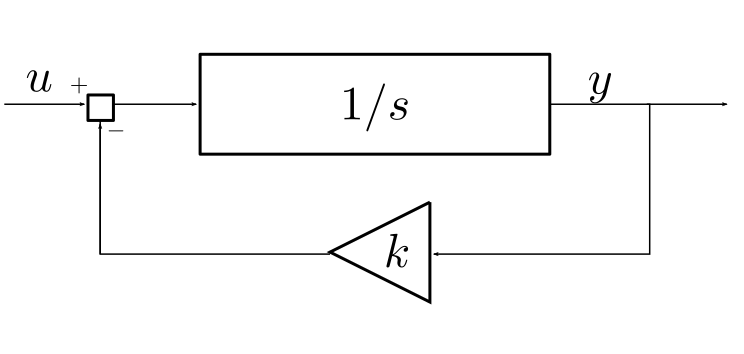  

--------------------------------------------------------------------------------

  - **Triangles** denote **gains** (scalar or matrix multipliers),

  - **Adders** sum (or substract) signals.

--------------------------------------------------------------------------------

  - **LTI systems** can be specified with:

      - (differential) equations,

      - the impulse response,

      - the transfer function,

Equivalent Systems
--------------------------------------------------------------------------------

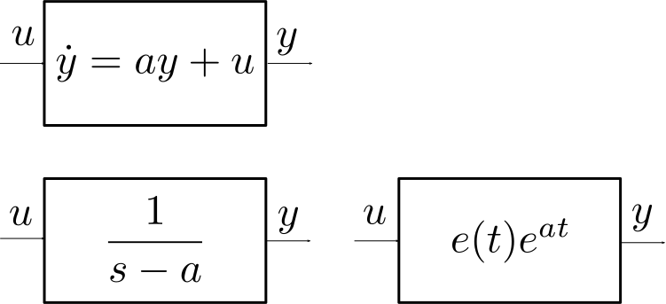  

<i class="fa fa-question-circle-o"></i> Block-Diagram / Feedback
--------------------------------------------------------------------------------

Compute the transfer function $H(s)$ of the system depicted 
in the feedback block-diagram example.

Impulse Response
--------------------------------------------------------------------------------

Why refer to $h(t)$ as the system "impulse response"?

By the way, what's an impulse?

<i class="fa fa-eye"></i> Impulses Approximations
--------------------------------------------------------------------------------

Pick a time constant $\epsilon > 0$ and define

  $$
  \delta_{\epsilon}(t) = \frac{1}{\epsilon} e^{-t/\epsilon} e(t)
  $$

--------------------------------------------------------------------------------

    def delta(t, eps=1.0):
        return exp(-t / eps) / eps * (t >= 0)

<i class="fa fa-area-chart"></i>
--------------------------------------------------------------------------------

    figure()
    t = linspace(-1,4,1000)
    plot(t, delta(t, eps=1.0), "k:", label="$\epsilon=1.0$")
    plot(t, delta(t, eps=0.5), "k--", label="$\epsilon=0.5$")
    plot(t, delta(t, eps=0.25), "k", label="$\epsilon=0.25$")
    xlabel("$t$"); title("$\delta_{\epsilon}(t)$") 
    legend()

::: hidden :::::::::::::::::::::::::::::::::::::::::::::::::::::::::::::::::::::

    tight_layout()
    save("images/impulses")

::::::::::::::::::::::::::::::::::::::::::::::::::::::::::::::::::::::::::::::::

::: slides :::::::::::::::::::::::::::::::::::::::::::::::::::::::::::::::::::::

--------------------------------------------------------------------------------

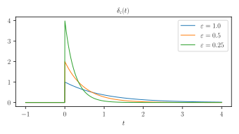

::::::::::::::::::::::::::::::::::::::::::::::::::::::::::::::::::::::::::::::::

Impulses in the Laplace Domain
--------------------------------------------------------------------------------

  $$
  \begin{split}
  \delta_{\epsilon}(s) 
    &= \int_{-\infty}^{+\infty} \delta_{\epsilon}(t) e^{-st} \, dt \\
    &= \frac{1}{\epsilon} \int_{0}^{+\infty} e^{-(s + 1/\epsilon)t} \, dt \\
    &= \frac{1}{\epsilon} 
       \left[ 
       \frac{e^{-(s+1/\epsilon)t}}{-(s+1/\epsilon)} 
       \right]^{+\infty}_0 = \frac{1}{1 + \epsilon s}\\
  \end{split}
  $$

(assuming that $\mathrm{Re}(s) > -1/\epsilon$)

--------------------------------------------------------------------------------

  - The "limit" of the signal $\delta_{\epsilon}(t)$ when $\epsilon \to 0$
    is not defined *as a function* (issue for $t=0$) but as a *generalized
    function* $\delta(t)$, the **unit impulse**. 

  - This technicality can be avoided in the Laplace domain where
      $$
      \delta(s) = \lim_{\epsilon \to 0} \delta_{\epsilon}(s)
      =
      \lim_{\epsilon \to 0} \frac{1}{1 + \epsilon s} = 1.
      $$

--------------------------------------------------------------------------------

Thus, if $y(t) = (h \ast u)(t)$ and

 1. $u(t) = \delta(t)$ then

 2. $y(s) = h(s) \times \delta(s) = h(s) \times 1 = h(s)$

 3. and thus $y(t) = h(t)$.

**Conclusion:**
the impulse response $h(t)$ is the output of the system when
the input is the unit impulse $\delta(t)$.

I/O Stability
--------------------------------------------------------------------------------

A system is **I/O-stable** if there is a $K \geq 0$ such that

$$
\mbox{for any } t\geq, \|y(t)\| \leq K M
$$

whenever

$$
\mbox{for any } t\geq, \|u(t)\| \leq M
$$

There is a bound on the amplification of the input signal that the system
can provide.

<i class="fa fa-sticky-note"></i>
Also called **BIBO-stability** (for "bounded input, bounded output")

Transfer Function Poles
--------------------------------------------------------------------------------

A **pole** of the transfer function $H(s)$ is a $s \in \mathbb{C}$ such that
for at least one element $H_{ij}(s)$,

$$
|H_{ij}(s)| = +\infty.
$$

I/O-Stability Criteria
--------------------------------------------------------------------------------

A system is I/O-stable if and only if all its poles are in the open left-plane,
i.e. such that

$$
\mbox{Re}(s) < 0.
$$

Internal Stability vs I/O-Stability
--------------------------------------------------------------------------------

If the system $\dot{x} = A x$ is asymptotically stable,
then for any matrices $B$, $C$, $D$ of appropriate sizes,

$$
\begin{split}
\dot{x} &= A x + B u \\
y &= C x + Du
\end{split}
$$

is I/O-stable.

Fully Actuated & Measured System
--------------------------------------------------------------------------------

If $B=I$, $C=I$ and $D=0$, that is

  $$
  \dot{x} = A x +u, \; y = x
  $$

then $H(s) = [sI-A]^{-1}$. 

--------------------------------------------------------------------------------

Therefore, $s$ is a pole of $H$ iff it's an eigenvalue of $A$.

Thus, in this case, asymptotic stability and I/O-stability are equivalent.

This equivalence holds under much weaker conditions.

<link href="https://fonts.googleapis.com/css?family=Inconsolata:400,700" rel="stylesheet"> 

<link href="https://cdnjs.cloudflare.com/ajax/libs/font-awesome/4.7.0/css/font-awesome.css" rel="stylesheet">
