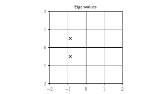

% Observers
% Sébastien Boisgérault, Mines ParisTech

Preamble
================================================================================

--------------------------------------------------------------------------------

    from numpy import *
    from numpy.linalg import *
    from numpy.testing import *
    from matplotlib.pyplot import *
    from scipy.integrate import *

::: notebook :::::::::::::::::::::::::::::::::::::::::::::::::::::::::::::::::::

    from numpy import *
    import matplotlib; matplotlib.use("nbAgg")
    %matplotlib inline
    from matplotlib.pyplot import *

::::::::::::::::::::::::::::::::::::::::::::::::::::::::::::::::::::::::::::::::

::: hidden :::::::::::::::::::::::::::::::::::::::::::::::::::::::::::::::::::::

    # Python 3.x Standard Library
    import gc
    import os

    # Third-Party Packages
    import numpy as np; np.seterr(all="ignore")
    import numpy.linalg as la
    import scipy.misc
    import matplotlib as mpl; mpl.use("Agg")
    import matplotlib.pyplot as pp
    import matplotlib.axes as ax
    import matplotlib.patches as pa

    #
    # Matplotlib Configuration & Helper Functions
    # --------------------------------------------------------------------------
    
    # TODO: also reconsider line width and markersize stuff "for the web
    #       settings".
    fontsize = 35

    rc = {
        "text.usetex": True,
        "pgf.preamble": [r"\usepackage{amsmath,amsfonts,amssymb}"], 
        #"font.family": "serif",
        "font.serif": [],
        #"font.sans-serif": [],
        "legend.fontsize": fontsize, 
        "axes.titlesize":  fontsize,
        "axes.labelsize":  fontsize,
        "xtick.labelsize": fontsize,
        "ytick.labelsize": fontsize,
        #"savefig.dpi": 300,
        #"figure.dpi": 300,
    }
    mpl.rcParams.update(rc)

    # Web target: 160 / 9 inches (that's ~45 cm, this is huge) at 90 dpi 
    # (the "standard" dpi for Web computations) gives 1600 px.
    width_in = 160 / 9 

    def save(name):
        cwd = os.getcwd()
        root = os.path.dirname(os.path.realpath(__file__))
        os.chdir(root)
        pp.savefig(name + ".svg")
        os.chdir(cwd)

    def set_ratio(ratio=1.0, bottom=0.1, top=0.1, left=0.1, right=0.1):
        height_in = (1.0 - left - right)/(1.0 - bottom - top) * width_in / ratio
        pp.gcf().set_size_inches((width_in, height_in))
        pp.gcf().subplots_adjust(bottom=bottom, top=1.0-top, left=left, right=1.0-right)

::::::::::::::::::::::::::::::::::::::::::::::::::::::::::::::::::::::::::::::::

Observability
================================================================================

Motivation
--------------------------------------------------------------------------------

Controling a system generally requires the knowledge of the state $x(t)$,
but measuring every state variable may be impossible (or too expensive).

Can we reduce the amount of physical sensors and still be able to
compute the state with "virtual" or "software" sensors ?

--------------------------------------------------------------------------------

Control engineers call these software devices **observers**.

First we adress the mathematical feasibility of observers: **observability**.

Definition
--------------------------------------------------------------------------------

The system 

$$
\left|
\begin{array}{rcl}
\dot{x} &=& f(x) \\
y &=& g(x)
\end{array}
\right.
$$ 

is **observable** if the knowledge of $y(t) = g(x(t))$ 
on some finite time span $[0, \tau]$ 
determines uniquely the initial condition $x(0)$. 

Remarks
--------------------------------------------------------------------------------

  - The knowledge of $x(0)$ determines uniquely $x(t)$ via the system dynamics.

  - Later, observers will provide merely **asymptotically exact** estimates
    $\hat{x}(t)$ of $x(t)$, that satisfy
    
    $\hat{x}(t) - x(t)$ when $t \to +\infty$.

Extension
--------------------------------------------------------------------------------

The definition of observability may be extended to systems with (known) inputs
$u$:

$$
\left|
\begin{array}{rcl}
\dot{x} &=& f(x, u) \\
y &=& g(x, u)
\end{array}
\right.
$$ 

In general, the input $u$ may then be selected specifically 
to generate the appropriate $y(t)$ that allows us to compute $x(0)$.

--------------------------------------------------------------------------------

But for linear systems, the choice of $u$ is irrelevant.

Indeed, if

$$
\left|
\begin{array}{rcl}
\dot{x} &=& Ax + Bu \\
y &=& C x + D u
\end{array}
\right.
$$ 

and we can deduce $x(0)$ from $y(t)$ when $u=0$:

$$
y_0(t) = C e^{At} x(0) \; \to \; x(0)
$$

--------------------------------------------------------------------------------

then in the general case, when we measure

$$
y_u(t) = C e^{At} x(0) + (H \ast u)(t) 
$$

we can compute

$$
y_0(t) = y_u(t) - (H \ast u)(t)
$$

and deduce $x(0)$ at this stage.

--------------------------------------------------------------------------------

<i class="fa fa-eye"></i> Observability / Car
--------------------------------------------------------------------------------

The position $x$ (in meters) of a car of mass $m$ (in kg) on a straight road
is governed by

$$
m \ddot{x} = u
$$

where $u$ the force (in Newtons) generated by its motor.

--------------------------------------------------------------------------------

  - we don't know where the car is at $t=0$,
  
  - we don't know what its initial speed was,

  - but we know that the car doesn't accelerate ($u=0$).

--------------------------------------------------------------------------------

If we measure the position $y(t) = x(t)$:

  - $x(0) = y(0)$ is known,

  - $\dot{x}(0) = \dot{y}(0)$ is also computable.

Thus the system is observable.

--------------------------------------------------------------------------------

But what if we measure instead the speed $y(t) = \dot{x}(t)$ ?

The system dynamics $m \ddot{x}(t) = u(t) = 0$ yields
$$
x(t) = x(0) + \dot{x}(0) t
$$
thus
$$
\dot{x}(t) = \dot{x}(0)
$$
and any $x(0)$ is consistent with a measure of a constant speed.

We can't deduce the position of the car from the measure of its speed;
the system is not observable.

Kalman Criterion
--------------------------------------------------------------------------------

The system $\dot{x} = Ax, \, y = C x$ is observable iff:

  $$
  \mathrm{rank} \, 
  \left[
  \begin{array}{c}
  C \\
  CA \\ 
  \vdots \\
  C A^{n-1}
  \end{array}
  \right] = n
  $$

$[C; \dots; C A^{n-1}]$ is the **Kalman observability matrix**.

("$;$" denotes the column concatenation of matrices)

Duality
--------------------------------------------------------------------------------

Since

$$
[C; \dots; C A^{n-1}]^t = [C^t, \dots, (A^t)^{n-1}C^t],
$$

the system $\dot{x} = A x, \; y = Cx$ is observable iff
the system $\dot{x} = A^t x + C^t u$ is controllable.

<i class="fa fa-question-circle-o"></i> Fully Measured System
--------------------------------------------------------------------------------

Consider $\dot{x} = A x, \; y = Cx$ with $x \in \mathbb{R}^n$, $y \in\mathbb{R}^p$ and $\mathrm{rank} \, C = n$.

  - [<i class="fa fa-lightbulb-o"></i>, <i class="fa fa-superscript"></i>] 
    Is the system observable ?

<i class="fa fa-question-circle-o"></i> Integrator Chain
--------------------------------------------------------------------------------

$$\dot{x}_n = 0, \, \dot{x}_{n-1} = x_n, \, \cdots \,, \dot{x}_1 = x_2, \, y=x_1$$

--------------------------------------------------------------------------------

  -  [<i class="fa fa-lightbulb-o"></i>, <i class="fa fa-superscript"></i>] 
     Show that the system is observable.

<i class="fa fa-question-circle-o"></i> Heat Equation
--------------------------------------------------------------------------------

--------------------------------------------------------------------------------

  - $d T_1/dt = 0 + (T_2 - T_1)$

  - $d T_2/dt = (T_1 - T_2) + (T_3 - T_2)$

  - $d T_3/dt = (T_2 - T_3) + (T_4 - T_3)$

  - $d T_4/dt = (T_3 - T_4)$

  - $y = T_4$

--------------------------------------------------------------------------------

  -  [<i class="fa fa-lightbulb-o"></i>, <i class="fa fa-superscript"></i>] 
     Show that the system is observable.

  -  [<i class="fa fa-lightbulb-o"></i>, <i class="fa fa-superscript"></i>] 
     Is it still true if the four cells are organized as a square and
     the temperature sensor is in any of the corners ? How many independent 
     sensors do you need to make the system observable and where can you
     place them?

Observer Design
================================================================================

--------------------------------------------------------------------------------

$$
\left|
\begin{split}
\dot{x} = A x + B u \\
y = C x + D u
\end{split}
\right.
$$

State Observer v1
--------------------------------------------------------------------------------

Simulate the system behavior

$$
\left|
\begin{split}
\frac{d\hat{x}}{dt} &= A \hat{x} + B u \\
\hat{y} &= C \hat{x} + D u
\end{split}
\right.
$$

and since we don't know better, 

$$
\hat{x}(0) = 0.
$$

State Estimate Error
--------------------------------------------------------------------------------

Does $\hat{x}(t)$ provide a good asymptotic estimate of $x(t)$ ?

--------------------------------------------------------------------------------

The dynamics of the **state estimate error** $e = \hat{x} - x$ is

$$
\begin{split}
\dot{e} & = \frac{d}{dt}(\hat{x} - x) \\
        & = \frac{d\hat{x}}{dt} - \dot{x} \\
        & = (A \hat{x} + Bu) - (A x + Bu) \\
        & = A e 
\end{split}
$$

--------------------------------------------------------------------------------

The state estimator error $e(t)$, solution of 

$$
\dot{e} = A e 
$$

doesn't satisfy  

$$
\lim_{t \to +\infty} e(t) = 0
$$

for every value of $e(0) = \hat{x}(0) - x(0)$,
**unless the eigenvalues of $A$ are in the open left-hand plane**
(i.e. $\dot{x} = A x$ is asymptotically stable).

State Observer v2
--------------------------------------------------------------------------------

Change the observer dynamics to account for differences between 
$\hat{y}$ and $y$ (both known values):

$$
\left|
\begin{split}
\frac{d\hat{x}}{dt} &= A \hat{x} + B u  - L (\hat{y} - y)\\
\hat{y} &= C \hat{x} + D u
\end{split}
\right.
$$

for some **observer gain** matrix $L \in \mathbb{R}^{n \times p}$  
(to be determined).

--------------------------------------------------------------------------------

--------------------------------------------------------------------------------

The new dynamics of $e = \hat{x} - x$ is

$$
\begin{split}
\dot{e} & = \frac{d}{dt}(\hat{x} - x) \\
        & = \frac{d\hat{x}}{dt} - \dot{x} \\
        & = (A \hat{x} + Bu - L(C \hat{x} - C x)) - (A x + Bu) \\
        & = (A - LC) e 
\end{split}
$$

Reminder
--------------------------------------------------------------------------------

The system $\dot{x} = A x, \; y = Cx$ is observable 

$\Longleftrightarrow$

The system $\dot{x} = A^t x + C^t u$ is commandable.

So what?
--------------------------------------------------------------------------------

In this case, we can perform arbitrary pole assignment:

  - for any conjugate set $\Lambda$ of eigenvalues, 

  - there is a matrix $K \in \mathbb{R}^{p \times n}$ such that

    $$
    \sigma(A^t - C^t K) = \Lambda
    $$

--------------------------------------------------------------------------------

Since $\sigma(M) = \sigma(M^t)$ for any square matrix $M$, 

$$
\begin{split}
\sigma(A^t - C^t K) & = \sigma((A - K^tC)^t) \\
                    & = \sigma(A - K^t C) \\
\end{split}
$$

Observers / Pole Assignment
--------------------------------------------------------------------------------

Thus, if we set

$$
L = K^t
$$

we have solved the pole assignment problem  **for observers:**

$$
\sigma(A - L C) = \Lambda
$$

<i class="fa fa-eye"></i> Observer/Pole Assignment
--------------------------------------------------------------------------------

Consider the double integrator $\ddot{y} = u$ 

  $$
  \frac{d}{dt}
  \left[\begin{array}{c} x_1 \\ x_2 \end{array}\right]
  =
  \left[\begin{array}{cx} 0 & 1 \\ 0 & 0\end{array}\right]
  \left[\begin{array}{c} x_1 \\ x_2 \end{array}\right]
  +
  \left[\begin{array}{c} 0 \\ 1 \end{array}\right] u
  $$

  $$
  y = 
  \left[
  \begin{array}{cc}
  1 & 0
  \end{array}
  \right]
  \left[\begin{array}{c} x_1 \\ x_2 \end{array}\right]
  $$

(in standard form)

--------------------------------------------------------------------------------

    from scipy.signal import place_poles
    A = array([[0, 1], [0, 0]])
    C = array([[1, 0]])
    poles = [-1, -2]
    K = place_poles(A.T, C.T, poles).gain_matrix
    L = K.T
    assert_almost_equal(K, [[3.0, 2.0]])

--------------------------------------------------------------------------------

  $$
  \frac{d}{dt}
  \left[\begin{array}{c} \hat{x}_1 \\ \hat{x}_2 \end{array}\right]
  =
  \left[\begin{array}{cx} 0 & 1 \\ 0 & 0\end{array}\right]
  \left[\begin{array}{c} \hat{x}_1 \\ \hat{x}_2 \end{array}\right]
  +
  \left[\begin{array}{c} 0 \\ 1 \end{array}\right] u
  - \left[\begin{array}{c} 3 \\2 \end{array}\right] (\hat{y} - y)
  $$

  $$
  \hat{y} = 
  \left[
  \begin{array}{cc}
  1 & 0
  \end{array}
  \right]
  \left[\begin{array}{c} \hat{x}_1 \\ \hat{x}_2 \end{array}\right]
  $$

<i class="fa fa-flask"></i> 
--------------------------------------------------------------------------------

    def fun(t, X_Xhat):
        x, x_hat = X_Xhat[0:2], X_Xhat[2:4]
        y, y_hat = C.dot(x), C.dot(x_hat)
        dx = A.dot(x)
        dx_hat = A.dot(x_hat) - L.dot(y_hat - y)
        return r_[dx, dx_hat]

--------------------------------------------------------------------------------

    y0 = [-2.0, 1.0, 0.0, 0.0]
    result = solve_ivp(fun=fun, t_span=[0.0, 5.0], y0=y0, max_step=0.1)

--------------------------------------------------------------------------------

    figure()
    t = result["t"]
    y = result["y"]
    plot(t, y[0], "b", label="$x_1$")
    plot(t, y[2], "b:", alpha=0.5, label=r"$\hat{x}_1$")
    plot(t, y[1], "g", label="$x_2$")
    plot(t, y[3], "g:", alpha=0.5, label=r"$\hat{x}_2$")
    grid(); legend()

::: hidden :::::::::::::::::::::::::::::::::::::::::::::::::::::::::::::::::::::

    save("images/observer-trajectories")

::::::::::::::::::::::::::::::::::::::::::::::::::::::::::::::::::::::::::::::::

::: slides :::::::::::::::::::::::::::::::::::::::::::::::::::::::::::::::::::::

--------------------------------------------------------------------------------

::::::::::::::::::::::::::::::::::::::::::::::::::::::::::::::::::::::::::::::::

Kalman Filtering
================================================================================

Setting
--------------------------------------------------------------------------------

Consider $\dot{x} = A x, \; y = Cx$ where: 

  - the state $x(t)$ is unknown ($x(0)$ is unknown),
  
  - only (a noisy version of) $y(t)$ is available.

We want a sensible estimation $\hat{x}(t)$ of $x(t)$.

--------------------------------------------------------------------------------

We now assume the existence of state and output disturbances 
$v(t)$ and $w(t)$ (deviations from the exact dynamics)

$$
\left|
\begin{split}
\dot{x} &= A x + v \\
y &= C x + w
\end{split}
\right.
$$

Thes disturbances (or "noises") are unknown; we are searching for the
estimate $\hat{x}(t)$ of $x(t)$ that
requires the smallest deviation from the exact dynamics to explain the data.

--------------------------------------------------------------------------------

For a known $y(t)$, among all possible trajectories $x(t)$ of the system,
find the one that minimizes

  $$ 
  J = \int_0^{+\infty} v(t)^t Q v(t) + w(t)^t R w(t) \, dt
  $$

where:

  - $Q \in \mathbb{R}^{n \times n}$ and $R \in \mathbb{R}^{p\times p}$,

  - (to be continued ...)

--------------------------------------------------------------------------------

  - $Q$ and $R$ are **symmetric** ($R^t = R$ and $Q^t = Q$),

  - $Q$ and $R$ are **positive definite** (denoted "$>0$")

Heuristics
--------------------------------------------------------------------------------

If it is known that there is a large state disturbance but small output
disturbance, it makes sense to reduce the impact of the state disturbance
in the composition of $J$, hence to select a small $Q$ wrt $R$.

<!--

--------------------------------------------------------------------------------

To balance the impact of the state disturbance and output disturbance error,
one may set:

$$
Q^{-1} = \mathbb{E} v(t)^t v(t),
R^{-1} = \mathbb{E} w(t)^t w(t).
$$

-->

Optimal Solution
--------------------------------------------------------------------------------

Assume that $\dot{x} = A x, \; y = Cx$ is observable.

There is a state estimation $\hat{x}(t)$, 
given for some $L \in \mathbb{R}^{n \times p}$ as the solution of

$$
\left|
\begin{split}
d\hat{x}/dt &= A \hat{x} - L (\hat{y} - y)\\
\hat{y} &= C \hat{x}
\end{split}
\right.
$$

The dynamics of the corresponding estimation error 
$e(t) = \hat{x}(t) - x(t)$ is asymptotically stable.

Algebraic Riccati Equation
--------------------------------------------------------------------------------

The gain matrix $L$ is given by

  $$
  L = \Sigma C^t R,
  $$
  
 where $\Sigma \in \mathbb{R}^{n \times n}$ is the unique matrix such that
 $\Sigma^t = \Sigma$, $\Sigma > 0$ and

   $$
   \Sigma C^t R C \Sigma - \Sigma A^t - A \Sigma - Q^{-1} = 0.
   $$

Optimal Control $\leftrightarrow$ Filter
--------------------------------------------------------------------------------

Solve the Ricatti equation for optimal control with 

$$
(A, B, Q, R) = (A^t, C^t, Q^{-1}, R^{-1})
$$

then

$\Sigma = \Pi^t$ and $L = K^t.$

<i class="fa fa-eye"></i> Kalman Filter
--------------------------------------------------------------------------------

Consider the system 
$$
\begin{split}
\dot{x} &= v\\
y &= x + w
\end{split}
$$

If we believe that the state and output perturbation are of the same scale, 
we may try

$$
Q=[1.0], R=[1.0]
$$

--------------------------------------------------------------------------------

With $\Sigma = [\sigma]$, the filtering Ricatti equation becomes

$$
\sigma^2 - 2\sigma  - 1 = 0
$$

whose only positive solution is

$$
\sigma = \frac{2 + \sqrt{(-2)^2 - 4\times 1 \times (-1)}}{2} = 1+\sqrt{2}.
$$

--------------------------------------------------------------------------------

With $L = [\ell]$, we end up with

$\ell = \sigma = 1 + \sqrt{2}.$

Thus, the optimal filter is

$$
\begin{split}
d\hat{x}/dt &= - (1+\sqrt{2})(\hat{y} - y)\\
\hat{y} &= \hat{x}
\end{split}
$$

<i class="fa fa-eye"></i> Stabilization/Kalman Filter
--------------------------------------------------------------------------------

Consider the double integrator $\ddot{x} = 0,$ $y=x$.

  $$
  \frac{d}{dt}
  \left[\begin{array}{c} x \\ \dot{x} \end{array}\right]
  =
  \left[\begin{array}{cc} 0 & 1 \\ 0 & 0\end{array}\right]
  \left[\begin{array}{c} x \\ \dot{x} \end{array}\right]
  +
  \left[\begin{array}{c} v_1 \\ v_2 \end{array}\right],
  y = \left[\begin{array}{c} 1 & 0 \end{array} \right]
  \left[\begin{array}{c} x \\ \dot{x} \end{array}\right]
  + w
  $$

(in standard form)

--------------------------------------------------------------------------------

    from scipy.linalg import solve_continuous_are
    A = array([[0, 1], [0, 0]])
    B = array([[0], [1]])
    Q = array([[1, 0], [0, 1]]); R = array([[1]])
    Sigma = solve_continuous_are(A.T, C.T, inv(Q), inv(R))
    L = Sigma @ C.T @ R
    eigenvalues, _ = eig(A - L @ C)
    assert all([real(s) < 0 for s in eigenvalues])

<i class="fa fa-area-chart"></i>
--------------------------------------------------------------------------------

    figure()
    x = [real(s) for s in eigenvalues]
    y = [imag(s) for s in eigenvalues]
    plot(x, y, "kx", ms=12.0)
    xticks([-2, -1, 0, 1, 2])
    yticks([-2, -1, 0, 1, 2])
    plot([0, 0], [-2, 2], "k")
    plot([-2, 2], [0, 0], "k")   
    grid(True)
    title("Eigenvalues")

::: hidden :::::::::::::::::::::::::::::::::::::::::::::::::::::::::::::::::::::

    axis("square")
    axis([-2, 2, -2, 2])
    save("images/poles-Kalman")

::::::::::::::::::::::::::::::::::::::::::::::::::::::::::::::::::::::::::::::::

::::: slides :::::::::::::::::::::::::::::::::::::::::::::::::::::::::::::::::::

--------------------------------------------------------------------------------

::::::::::::::::::::::::::::::::::::::::::::::::::::::::::::::::::::::::::::::::

--------------------------------------------------------------------------------

<i class="fa fa-flask"></i> 
--------------------------------------------------------------------------------

    def fun(t, X_Xhat):
        x, x_hat = X_Xhat[0:2], X_Xhat[2:4]
        y, y_hat = C.dot(x), C.dot(x_hat)
        dx = A.dot(x)
        dx_hat = A.dot(x_hat) - L.dot(y_hat - y)
        return r_[dx, dx_hat]

--------------------------------------------------------------------------------

    y0 = [-2.0, 1.0, 0.0, 0.0]
    result = solve_ivp(fun=fun, t_span=[0.0, 5.0], y0=y0, max_step=0.1)

--------------------------------------------------------------------------------

    figure()
    t = result["t"]
    y = result["y"]
    plot(t, y[0], "b", label="$x_1$")
    plot(t, y[2], "b:", alpha=0.5, label=r"$\hat{x}_1$")
    plot(t, y[1], "g", label="$x_2$")
    plot(t, y[3], "g:", alpha=0.5, label=r"$\hat{x}_2$")
    grid(); legend()

::: hidden :::::::::::::::::::::::::::::::::::::::::::::::::::::::::::::::::::::

    save("images/observer-Kalman-trajectories")

::::::::::::::::::::::::::::::::::::::::::::::::::::::::::::::::::::::::::::::::

::: slides :::::::::::::::::::::::::::::::::::::::::::::::::::::::::::::::::::::

--------------------------------------------------------------------------------

::::::::::::::::::::::::::::::::::::::::::::::::::::::::::::::::::::::::::::::::

<!--

--------------------------------------------------------------------------------

    def f(t, y):
        return 0.0
    def g(y):
        return y

    y0 = [10.0]
    tspan = [0.0, 20.0]
    result = solve_ivp(f, tspan, y0, dense_output=True)
    t = linspace(tspan[0], tspan[-1], 1000)
    x = result["sol"](t)[0]

--------------------------------------------------------------------------------

    figure()
    plot(t, x, "k", label=r"$x(t)$")
    output = lambda t: g(result["sol"](t)[0])
    plot(t, output(t), "k--", label=r"$y(t)$")
    grid(True)

::: hidden :::::::::::::::::::::::::::::::::::::::::::::::::::::::::::::::::::::

    save("images/K")

::::::::::::::::::::::::::::::::::::::::::::::::::::::::::::::::::::::::::::::::

::: slides :::::::::::::::::::::::::::::::::::::::::::::::::::::::::::::::::::::

--------------------------------------------------------------------------------

::::::::::::::::::::::::::::::::::::::::::::::::::::::::::::::::::::::::::::::::

--------------------------------------------------------------------------------

    def f(t, y):
        return - (1+ sqrt(2)) * (y[0] - output(t))

    y0 = [1.0]
    result2 = solve_ivp(f, tspan, y0, dense_output=True)
    t = linspace(tspan[0], tspan[-1], 1000)
    x_hat = result2["sol"](t)[0]

--------------------------------------------------------------------------------

    figure()
    plot(t, x, "k", label=r"$x(t)$")
    plot(t, output(t), "k--", label=r"$y(t)$")
    plot(t, x_hat, "g")
    grid(True)

::: hidden :::::::::::::::::::::::::::::::::::::::::::::::::::::::::::::::::::::

    save("images/K2")

::::::::::::::::::::::::::::::::::::::::::::::::::::::::::::::::::::::::::::::::

::: slides :::::::::::::::::::::::::::::::::::::::::::::::::::::::::::::::::::::

--------------------------------------------------------------------------------

::::::::::::::::::::::::::::::::::::::::::::::::::::::::::::::::::::::::::::::::

-->

<link href="https://fonts.googleapis.com/css?family=Inconsolata:400,700" rel="stylesheet"> 

<link href="https://cdnjs.cloudflare.com/ajax/libs/font-awesome/4.7.0/css/font-awesome.css" rel="stylesheet">
