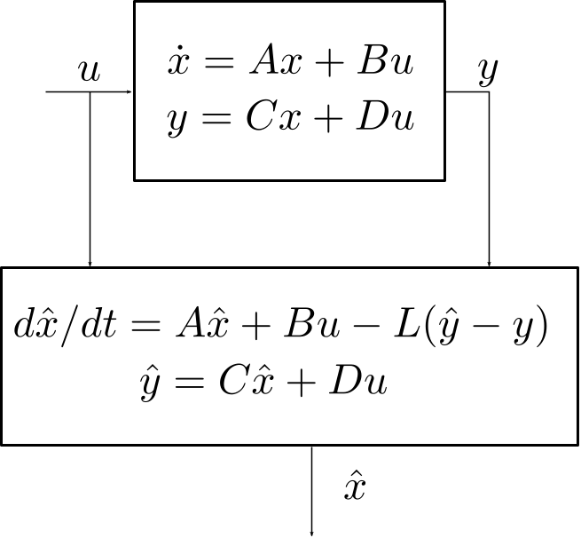

## Control Engineering with Python

- ©️ License Creative Commons [CC BY 4.0](https://creativecommons.org/licenses/by/4.0/)

- 🏠 [GitHub Homepage](https://github.com/boisgera/control-engineering-with-python>)

## Notations

|     |             |     |                        |
| --- | ----------- | --- | ---------------------- |
| 🐍  | Code        | 🔍  | Example                |
| 📈  | Graph       | 🧩  | Exercise               |
| 🏷️  | Definition  | 💻  | Computation (Computer) |
| 💎  | Theorem     | 🧮  | Computation (Hand)     |
| 📝  | Remark      | 🧠  | Theory                 |
| ℹ️  | Information | 🗝️  | Hint                   |
| ⚠️  | Warning     | 🔓  | Solution               |

## 🐍 Imports

```python
from numpy import *
from numpy.linalg import *
from scipy.integrate import solve_ivp
from scipy.linalg import solve_continuous_are
from matplotlib.pyplot import *
from numpy.testing import *
```

::: hidden :::::::::::::::::::::::::::::::::::::::::::::::::::::::::::::::::::::

    # Python 3.x Standard Library
    import gc
    import os

    # Third-Party Packages
    import numpy as np; np.seterr(all="ignore")
    import numpy.linalg as la
    import scipy.misc
    import matplotlib as mpl; mpl.use("Agg")
    import matplotlib.pyplot as pp
    import matplotlib.axes as ax
    import matplotlib.patches as pa


    #
    # Matplotlib Configuration & Helper Functions
    # --------------------------------------------------------------------------

    # TODO: also reconsider line width and markersize stuff "for the web
    #       settings".
    fontsize = 10

    width = 345 / 72.27
    height = width / (16/9)

    rc = {
        "text.usetex": True,
        "pgf.preamble": r"\usepackage{amsmath,amsfonts,amssymb}",
        #"font.family": "serif",
        "font.serif": [],
        #"font.sans-serif": [],
        "legend.fontsize": fontsize,
        "axes.titlesize":  fontsize,
        "axes.labelsize":  fontsize,
        "xtick.labelsize": fontsize,
        "ytick.labelsize": fontsize,
        "figure.max_open_warning": 100,
        #"savefig.dpi": 300,
        #"figure.dpi": 300,
        "figure.figsize": [width, height],
        "lines.linewidth": 1.0,
    }
    mpl.rcParams.update(rc)

    # Web target: 160 / 9 inches (that's ~45 cm, this is huge) at 90 dpi
    # (the "standard" dpi for Web computations) gives 1600 px.
    width_in = 160 / 9

    def save(name, **options):
        cwd = os.getcwd()
        root = os.path.dirname(os.path.realpath(__file__))
        os.chdir(root)
        pp.savefig(name + ".svg", **options)
        os.chdir(cwd)

    def set_ratio(ratio=1.0, bottom=0.1, top=0.1, left=0.1, right=0.1):
        height_in = (1.0 - left - right)/(1.0 - bottom - top) * width_in / ratio
        pp.gcf().set_size_inches((width_in, height_in))
        pp.gcf().subplots_adjust(bottom=bottom, top=1.0-top, left=left, right=1.0-right)


::::::::::::::::::::::::::::::::::::::::::::::::::::::::::::::::::::::::::::::::

## 🐍 Stream Plot Helper

```python
def Q(f, xs, ys):
    X, Y = meshgrid(xs, ys)
    fx = vectorize(lambda x, y: f([x, y])[0])
    fy = vectorize(lambda x, y: f([x, y])[1])
    return X, Y, fx(X, Y), fy(X, Y)
```

🧭 Observability {.r-fit-text}
--------------------------------------------------------------------------------


Motivation
--------------------------------------------------------------------------------

Controling a system generally requires the knowledge of the state $x(t)$,
but measuring every state variable may be impossible (or too expensive).

Can we reduce the amount of physical sensors and still be able to
compute the state with "virtual" or "software" sensors ?

--------------------------------------------------------------------------------

Control engineers call these software devices **observers**.

First we adress the mathematical feasibility of observers: **observability**.

🏷️ Observability
--------------------------------------------------------------------------------

The system 

$$
\left|
\begin{array}{rcl}
\dot{x} &=& f(x) \\
y &=& g(x)
\end{array}
\right.
$$ 

is **observable** if the knowledge of $y(t) = g(x(t))$ 
on some finite time span $[0, \tau]$ 
determines uniquely the initial condition $x(0)$. 

📝 Remarks
--------------------------------------------------------------------------------

  - The knowledge of $x(0)$ determines uniquely $x(t)$ via the system dynamics.

  - Later, observers will provide merely **asymptotically exact** estimates
    $\hat{x}(t)$ of $x(t)$, that satisfy
    
    $\hat{x}(t) - x(t)$ when $t \to +\infty$.

Extension
--------------------------------------------------------------------------------

The definition of observability may be extended to systems with (known) inputs
$u$:

$$
\left|
\begin{array}{rcl}
\dot{x} &=& f(x, u) \\
y &=& g(x, u)
\end{array}
\right.
$$ 

In general, the input $u$ may then be selected specifically 
to generate the appropriate $y(t)$ that allows us to compute $x(0)$.

--------------------------------------------------------------------------------

But for linear systems, the choice of $u$ is irrelevant.

Indeed, if

$$
\left|
\begin{array}{rcl}
\dot{x} &=& Ax + Bu \\
y &=& C x + D u
\end{array}
\right.
$$ 

and we can deduce $x(0)$ from $y(t)$ when $u=0$:

$$
y_0(t) = C e^{At} x(0) \; \to \; x(0)
$$

--------------------------------------------------------------------------------

then in the general case, when we measure

$$
y_u(t) = C e^{At} x(0) + (H \ast u)(t) 
$$

we can compute

$$
y_0(t) = y_u(t) - (H \ast u)(t)
$$

and deduce $x(0)$ at this stage.

🔍 Observability / Car
--------------------------------------------------------------------------------

The position $x$ (in meters) of a car of mass $m$ (in kg) on a straight road
is governed by

$$
m \ddot{x} = u
$$

where $u$ the force (in Newtons) generated by its motor.

--------------------------------------------------------------------------------

  - we don't know where the car is at $t=0$,
  
  - we don't know what its initial speed was,

  - but we know that the car doesn't accelerate ($u=0$).

--------------------------------------------------------------------------------

If we measure the position $y(t) = x(t)$:

  - $x(0) = y(0)$ is known,

  - $\dot{x}(0) = \dot{y}(0)$ is also computable.

Thus the system is observable.

--------------------------------------------------------------------------------

### 🤔 What if?

What if we measure the speed instead of the location ?

$$
y(t) = \dot{x}(t)
$$

--------------------------------------------------------------------------------

The system dynamics $m \ddot{x}(t) = u(t) = 0$ yields $x(t) = x(0) + \dot{x}(0) t$
thus
$$
\dot{x}(t) = \dot{x}(0)
$$
and any $x(0)$ is consistent with a measure of a constant speed.

We can't deduce the position of the car from the measure of its speed;
the system is not observable.

💎 Kalman Criterion
--------------------------------------------------------------------------------

The system $\dot{x} = Ax, \, y = C x$ is observable iff:

  $$
  \mathrm{rank} \, 
  \left[
  \begin{array}{c}
  C \\
  CA \\ 
  \vdots \\
  C A^{n-1}
  \end{array}
  \right] = n
  $$

$[C; \dots; C A^{n-1}]$ is the **Kalman observability matrix**.


Notation
--------------------------------------------------------------------------------

  - "$,$" row concatenation of matrices.

  - "$;$" column concatenation of matrices.

We have

$$
[C; \cdots; C A^{n-1}]^t = [C^t, \cdots, (A^t)^{n-1}C^t].
$$

💎 Duality
--------------------------------------------------------------------------------

The system $\dot{x} = A x, \; y = Cx$ is observable 

$$\Longleftrightarrow$$

The system $\dot{x} = A^t x + C^t u$ is controllable.


🧩 Fully Measured System
--------------------------------------------------------------------------------

Consider 

$$\dot{x} = A x, \; y = Cx$$ 

with $x \in \mathbb{R}^n$, $y \in\mathbb{R}^p$ and $\mathrm{rank} \, C = n$.

## 

### 1. 🧠 🧮 

Is the system observable ?

🔓 Fully Measured System
--------------------------------------------------------------------------------

--------------------------------------------------------------------------------

### 1. 🔓

Yes! The rank of its observability matrix
  $$
  \left[
  \begin{array}{c}
  C \\
  CA \\ 
  \vdots \\
  C A^{n-1}
  \end{array}
  \right]
  $$
is at most $n$ and at least the rank of $C$, which is also $n$. Thus by
the [💎 Kalman Criterion], the system is observable.

🧩 Integrator Chain 
--------------------------------------------------------------------------------


$$\dot{x}_n = 0, \, \dot{x}_{n-1} = x_n, \, \cdots \,, \dot{x}_1 = x_2, \, y=x_1$$

--------------------------------------------------------------------------------

### 1. 🧠 🧮 

Show that the system is observable.

🔓 Integrator Chain
--------------------------------------------------------------------------------

--------------------------------------------------------------------------------

### 1. 🔓

The standard form of the dynamics associated to the state 
$x = (x_1, \dots, x_n)$ is characterized by

$$
A = \left[ 
\begin{array}{ccccc}
0 & 1 & 0 & \cdots &0 \\
0 & 0 & 1 & \ddots & \vdots\\
\vdots  & \ddots & \ddots & \ddots & 0 \\
\vdots  & \ddots &\ddots & 0 & 1 \\
0  & \cdots  &  \cdots      & 0 & 0
\end{array}  
\right], \;
C = \left[1, 0, 0, \dots, 0 \right]
$$

--------------------------------------------------------------------------------

Thus, 
$$
\begin{array}{rl}
C &=& \left[1, 0, 0, \dots, 0 \right] \\
CA &=& \left[0, 1,0, \dots, 0 \right] \\
\vdots &=& \vdots \\
CA^{n-1} &=& \left[0, 0, 0, \dots, 1 \right]
\end{array}
$$
The observability matrix has rank $n$ and hence the system of observable.

🧩 Heat Equation
--------------------------------------------------------------------------------


--------------------------------------------------------------------------------

  - $d T_1/dt = 0 + (T_2 - T_1)$

  - $d T_2/dt = (T_1 - T_2) + (T_3 - T_2)$

  - $d T_3/dt = (T_2 - T_3) + (T_4 - T_3)$

  - $d T_4/dt = (T_3 - T_4)$

  - $y = T_4$


--------------------------------------------------------------------------------

### 1. 🧠 🧮
     
Show that the system is observable.

--------------------------------------------------------------------------------

### 2. 🧮

{style="display:block;margin:auto;"}


Is it still true if the four cells are organized as a square and
the temperature sensor is in any of the corners ? 

--------------------------------------------------------------------------------

### 3. 🧠 🧮

Can you make the system observable with two (adequatly located) sensors?

🔓 Heat Equation
--------------------------------------------------------------------------------

--------------------------------------------------------------------------------

### 1. 🔓

The standard form of the dynamics associated to the state 
$T = (T_1, T_2, T_3, T4)$ is characterized by

$$
A = \left[ 
\begin{array}{cccc}
-1 & 1 & 0 & 0 \\
1 & -2 & 1 & 0 \\
0 & 1 & -2 & 1 \\
0 & 0 & 1 & -1
\end{array}  
\right], \;
C = \left[0, 0, 0, 1 \right]
$$

--------------------------------------------------------------------------------

Therefore the observability matrix is 
$$
\left[
\begin{array}{rrrr}
0 & 0 & 0 & 1 \\
0 & 0 & 1 & -1 \\
0 & 1 & -3 & 2 \\
1 & -5 & 9 & 5
\end{array}
\right]
$$
whose rank is 4: the system is observable.

--------------------------------------------------------------------------------

### 2. 🔓

In the square configuration, there is no way to get observability with a 
single thermometer.


{style="display:block;margin:auto;"}


--------------------------------------------------------------------------------

Indeed the new $A$ matrix would be
$$
A = \left[ 
\begin{array}{rrrr}
-2 &  1 &  1 &  0 \\
 1 & -2 &  0 &  1 \\
-1 &  0 & -2 &  1 \\
 0 &  1 &  1 & -2
\end{array}  
\right]
$$

and the new $C$ matrix one of
$$
\left[1, 0, 0, 0 \right], \;
\left[0, 1, 0, 0 \right], \;
\left[0, 0, 1, 0 \right], \;
\left[0, 0, 0, 1 \right]
$$

--------------------------------------------------------------------------------

The corresponding observability matrices are 

$$
\left[
\begin{array}{rrrr}
1 & 0 & 0 & 0 \\
-2 & 1 & 1 & 0 \\
4 & -4 & -4 & 2 \\
4 & -4 & -4 & 2
\end{array}
\right], \;
\left[
\begin{array}{rrrr}
0 & 1 & 0 & 0 \\
1 & -2 & 0 & 1 \\
-4 & 6 & 2 & -4 \\
-4 & 6 & 2 & -4
\end{array}
\right],
$$


$$
\left[
\begin{array}{rrrr}
0 & 0 & 1 & 0 \\
-1 & 0 & -2 & 1 \\
4 & 0 & 4 & -4 \\
4 & 0 & 4 & -4
\end{array}
\right], \;
\left[
\begin{array}{rrrr}
0 & 0 & 0 & 1 \\
0 & 1 & 1 & -2 \\
0 & -4 & -4 & 6 \\
0 & -4 & -4 & 6
\end{array}
\right]
$$

--------------------------------------------------------------------------------

All the possible observability matrices in this case have rank 3 < 4.

--------------------------------------------------------------------------------

### 3. 🔓

With 2 sensors, "it depends" (on the location of the sensors). For example:

{style="display:block;margin:auto;"}

--------------------------------------------------------------------------------

The first case corresponds to

$$
C = \left[
\begin{array}{rrrr}
1 & 0 & 0 & 0 \\
0 & 0 & 0 & 1
\end{array}
\right]
$$

the second one to

$$
C = \left[
\begin{array}{rrrr}
0 & 1 & 0 & 0 \\
0 & 0 & 0 & 1
\end{array}
\right]
$$

--------------------------------------------------------------------------------

The observability matrices are

$$
\left[
\begin{array}{rrrr}
1 & 0 & 0 & 0 \\
0 & 0 & 0 & 1 \\
-2 & 1 & 1 & 0 \\
0 & 1 & 1 & -2 \\
4 & -4 & -4 & 2 \\
0 & -4 & -4 & 6 \\
4 & -4 & -4 & 2 \\
0 & -4 & -4 & 6 \\
\end{array}
\right], \;
\left[
\begin{array}{rrrr}
0 & 1 & 0 & 0 \\
0 & 0 & 0 & 1 \\
-1 & -2 & 0 & 1 \\
0 & 1 & 1 & -2 \\
-4 & 6 & 2 & -4 \\
0 & -4 & -4 & 6 \\
-4 & 6 & 2 & -4 \\
0 & -4 & -4 & 6 \\
\end{array}
\right]
$$

The first has rank 3, the second rank 4.


🧭 Observer Design  {.r-fit-text}
--------------------------------------------------------------------------------


--------------------------------------------------------------------------------

$$
\left|
\begin{split}
\dot{x} = A x + B u \\
y = C x + D u
\end{split}
\right.
$$

State Observer (Version 1)
--------------------------------------------------------------------------------

Simulate the system behavior

$$
\left|
\begin{split}
\frac{d\hat{x}}{dt} &= A \hat{x} + B u \\
\hat{y} &= C \hat{x} + D u
\end{split}
\right.
$$

and since we don't know better, 

$$
\hat{x}(0) = 0.
$$


--------------------------------------------------------------------------------

Is $\hat{x}(t)$ a good asymptotic estimate of $x(t)$?


State Estimate Error
--------------------------------------------------------------------------------

The dynamics of the **state estimate error** $e = \hat{x} - x$ is

$$
\begin{split}
\dot{e} & = \frac{d}{dt}(\hat{x} - x) \\
        & = \frac{d\hat{x}}{dt} - \dot{x} \\
        & = (A \hat{x} + Bu) - (A x + Bu) \\
        & = A e 
\end{split}
$$

💎 State Estimator v1
--------------------------------------------------------------------------------

### ❌ Failure

The state estimator error $e(t)$, solution of 

$$
\dot{e} = A e 
$$

doesn't satisfy in general

$$
\lim_{t \to +\infty} e(t) = 0.
$$

--------------------------------------------------------------------------------

We have

$$
\lim_{t \to +\infty} e(t) = 0
$$

for every value of $e(0) = \hat{x}(0) - x(0)$, if and only if
$\dot{x} = A x$ is asymptotically stable (i.e. the eigenvalues of $A$ are in the open left-hand plane).


State Observer (Version 2)
--------------------------------------------------------------------------------

Change the observer dynamics to account for differences between 
$\hat{y}$ and $y$ (both known values):

$$
\left|
\begin{split}
\frac{d\hat{x}}{dt} &= A \hat{x} + B u  - L (\hat{y} - y)\\
\hat{y} &= C \hat{x} + D u
\end{split}
\right.
$$

for some **observer gain** matrix $L \in \mathbb{R}^{n \times p}$  
(to be determined).


--------------------------------------------------------------------------------

{style="display:block;margin:auto;"}

--------------------------------------------------------------------------------

The new dynamics of $e = \hat{x} - x$ is

$$
\begin{split}
\dot{e} & = \frac{d}{dt}(\hat{x} - x) \\
        & = \frac{d\hat{x}}{dt} - \dot{x} \\
        & = (A \hat{x} + Bu - L(C \hat{x} - C x)) - (A x + Bu) \\
        & = (A - LC) e 
\end{split}
$$

📝 Reminder
--------------------------------------------------------------------------------

The system $\dot{x} = A x, \; y = Cx$ is observable 

$$\Longleftrightarrow$$

The system $\dot{x} = A^t x + C^t u$ is commandable.

So what?
--------------------------------------------------------------------------------

In this case, we can perform arbitrary pole assignment:

  - for any conjugate set $\Lambda$ of eigenvalues, 

  - there is a matrix $K \in \mathbb{R}^{p \times n}$ such that

    $$
    \sigma(A^t - C^t K) = \Lambda
    $$

--------------------------------------------------------------------------------

Since $\sigma(M) = \sigma(M^t)$ for any square matrix $M$, 

$$
\begin{split}
\sigma(A^t - C^t K) & = \sigma((A - K^tC)^t) \\
                    & = \sigma(A - K^t C) \\
\end{split}
$$

Pole Assignment (Observers)
--------------------------------------------------------------------------------

### ✔️ Success

Thus, if we set

$$
L = K^t
$$

we have solved the pole assignment problem  **for observers:**

$$
\sigma(A - L C) = \Lambda
$$

🔍 Pole Assignment
--------------------------------------------------------------------------------

Consider the double integrator $\ddot{y} = u$ 

  $$
  \frac{d}{dt}
  \left[\begin{array}{c} x_1 \\ x_2 \end{array}\right]
  =
  \left[\begin{array}{cx} 0 & 1 \\ 0 & 0\end{array}\right]
  \left[\begin{array}{c} x_1 \\ x_2 \end{array}\right]
  +
  \left[\begin{array}{c} 0 \\ 1 \end{array}\right] u
  $$

  $$
  y = 
  \left[
  \begin{array}{cc}
  1 & 0
  \end{array}
  \right]
  \left[\begin{array}{c} x_1 \\ x_2 \end{array}\right]
  $$

(in standard form)

--------------------------------------------------------------------------------

### 🐍 💻


```python
from scipy.signal import place_poles
A = array([[0, 1], [0, 0]])
C = array([[1, 0]])
poles = [-1, -2]
K = place_poles(A.T, C.T, poles).gain_matrix
L = K.T
assert_almost_equal(K, [[3.0, 2.0]])
```

--------------------------------------------------------------------------------

$$
\frac{d}{dt}
\left[\begin{array}{c} \hat{x}_1 \\ \hat{x}_2 \end{array}\right]
=
\left[\begin{array}{cx} 0 & 1 \\ 0 & 0\end{array}\right]
\left[\begin{array}{c} \hat{x}_1 \\ \hat{x}_2 \end{array}\right]
+
\left[\begin{array}{c} 0 \\ 1 \end{array}\right] u
- \left[\begin{array}{c} 3 \\2 \end{array}\right] (\hat{y} - y)
$$

$$
\hat{y} = 
\left[
\begin{array}{cc}
1 & 0
\end{array}
\right]
\left[\begin{array}{c} \hat{x}_1 \\ \hat{x}_2 \end{array}\right]
$$

--------------------------------------------------------------------------------

### 🐍

```python
def fun(t, X_Xhat):
    x, x_hat = X_Xhat[0:2], X_Xhat[2:4]
    y, y_hat = C.dot(x), C.dot(x_hat)
    dx = A.dot(x)
    dx_hat = A.dot(x_hat) - L.dot(y_hat - y)
    return r_[dx, dx_hat]
```

--------------------------------------------------------------------------------


### 🐍 💻


```python
y0 = [-2.0, 1.0, 0.0, 0.0]
result = solve_ivp(
    fun=fun, 
    t_span=[0.0, 5.0], 
    y0=y0, 
    max_step=0.1
)
```

--------------------------------------------------------------------------------

### 🐍 📈


```python
figure()
t = result["t"]
y = result["y"]
plot(t, y[0], "C0", label="$x_1$")
plot(t, y[2], "C0--", label=r"$\hat{x}_1$")
plot(t, y[1], "C1", label="$x_2$")
plot(t, y[3], "C1--", label=r"$\hat{x}_2$")
xlabel("$t$"); grid(); legend()
```

::: hidden :::::::::::::::::::::::::::::::::::::::::::::::::::::::::::::::::::::

```python
pp.gcf().subplots_adjust(bottom=0.2)
save("images/observer-trajectories")
```

::::::::::::::::::::::::::::::::::::::::::::::::::::::::::::::::::::::::::::::::

::: slides :::::::::::::::::::::::::::::::::::::::::::::::::::::::::::::::::::::

## {.section  data-background="images/observer-trajectories.svg" data-background-size="contain"}

::::::::::::::::::::::::::::::::::::::::::::::::::::::::::::::::::::::::::::::::

🧭 Kalman Filter  {.r-fit-text}
--------------------------------------------------------------------------------

Setting
--------------------------------------------------------------------------------

Consider $\dot{x} = A x, \; y = Cx$ where: 

  - the state $x(t)$ is unknown ($x(0)$ is unknown),
  
  - only (a noisy version of) $y(t)$ is available.

We want a sensible estimation $\hat{x}(t)$ of $x(t)$.

--------------------------------------------------------------------------------

We now assume the existence of state and output disturbances 
$v(t)$ and $w(t)$ (deviations from the exact dynamics)

$$
\left|
\begin{split}
\dot{x} &= A x + v \\
y &= C x + w
\end{split}
\right.
$$

Thes disturbances (or "noises") are unknown; we are searching for the
estimate $\hat{x}(t)$ of $x(t)$ that
requires the smallest deviation from the exact dynamics to explain the data.

--------------------------------------------------------------------------------

For a known $y(t)$, among all possible trajectories $x(t)$ of the system,
find the one that minimizes

  $$ 
  J = \int_0^{+\infty} v(t)^t Q v(t) + w(t)^t R w(t) \, dt
  $$

where:

  - $Q \in \mathbb{R}^{n \times n}$ and $R \in \mathbb{R}^{p\times p}$,

  - (to be continued ...)

--------------------------------------------------------------------------------

  - $Q$ and $R$ are **symmetric** ($R^t = R$ and $Q^t = Q$),

  - $Q$ and $R$ are **positive definite** (denoted "$>0$")

Heuristics
--------------------------------------------------------------------------------

If it is known that there is a large state disturbance but small output
disturbance, it makes sense to reduce the impact of the state disturbance
in the composition of $J$, hence to select a small $Q$ wrt $R$.

💎 Optimal Solution
--------------------------------------------------------------------------------

Assume that $\dot{x} = A x, \; y = Cx$ is observable.

There is a state estimation $\hat{x}(t)$, 
given for some $L \in \mathbb{R}^{n \times p}$ as the solution of

$$
\left|
\begin{split}
d\hat{x}/dt &= A \hat{x} - L (\hat{y} - y)\\
\hat{y} &= C \hat{x}
\end{split}
\right.
$$

The dynamics of the corresponding estimation error 
$e(t) = \hat{x}(t) - x(t)$ is asymptotically stable.

💎 Algebraic Riccati Equation
--------------------------------------------------------------------------------

The gain matrix $L$ is given by

  $$
  L = \Pi C^t R,
  $$
  
 where $\Pi \in \mathbb{R}^{n \times n}$ is the unique matrix such that
 $\Pi^t = \Pi$, $\Pi > 0$ and

   $$
   \Pi C^t R C \Pi - \Pi A^t - A \Pi - Q^{-1} = 0.
   $$

Optimal Control $\leftrightarrow$ Filter
--------------------------------------------------------------------------------

Solve the Ricatti equation for optimal control with 

$$
(A, B, Q, R) = (A^t, C^t, Q^{-1}, R^{-1})
$$

then define

$$
L := \Pi  C^t  R
$$

🔍 Kalman Filter
--------------------------------------------------------------------------------

Consider the system 
$$
\begin{split}
\dot{x} &= v\\
y &= x + w
\end{split}
$$

If we believe that the state and output perturbation are of the same scale, 
we may try

$$
Q=[1.0], R=[1.0]
$$

--------------------------------------------------------------------------------

With $\Pi = [\sigma]$, the filtering Ricatti equation becomes

$$
\sigma^2 - 2\sigma  - 1 = 0
$$

whose only positive solution is

$$
\sigma = \frac{2 + \sqrt{(-2)^2 - 4\times 1 \times (-1)}}{2} = 1+\sqrt{2}.
$$

--------------------------------------------------------------------------------

With $L = [\ell]$, we end up with

$\ell = \sigma = 1 + \sqrt{2}.$

Thus, the optimal filter is

$$
\begin{split}
d\hat{x}/dt &= - (1+\sqrt{2})(\hat{y} - y)\\
\hat{y} &= \hat{x}
\end{split}
$$


🔍 Stabilization/Kalman Filter
--------------------------------------------------------------------------------

Consider the double integrator $\ddot{x} = 0,$ $y=x$.

  $$
  \frac{d}{dt}
  \left[\begin{array}{c} x \\ \dot{x} \end{array}\right]
  =
  \left[\begin{array}{cc} 0 & 1 \\ 0 & 0\end{array}\right]
  \left[\begin{array}{c} x \\ \dot{x} \end{array}\right]
  +
  \left[\begin{array}{c} v_1 \\ v_2 \end{array}\right],
  y = \left[\begin{array}{c} 1 & 0 \end{array} \right]
  \left[\begin{array}{c} x \\ \dot{x} \end{array}\right]
  + w
  $$

(in standard form)

--------------------------------------------------------------------------------


### 🐍


```python
A = array([[0, 1], [0, 0]])
B = array([[0], [1]])
Q = array([[1, 0], [0, 1]])
R = array([[1]])
```

--------------------------------------------------------------------------------


### 🐍 💻

```python
sca = solve_continuous_are
Sigma = sca(A.T, C.T, inv(Q), inv(R))
L = Sigma @ C.T @ R

eigenvalues, _ = eig(A - L @ C)
assert all([real(s) < 0 for s in eigenvalues])
```

--------------------------------------------------------------------------------


### 🐍 📈


```python
figure()
x = [real(s) for s in eigenvalues]
y = [imag(s) for s in eigenvalues]
plot(x, y, "kx")
```

--------------------------------------------------------------------------------

### 🐍 📈


```python
xticks([-2, -1, 0, 1, 2])
yticks([-2, -1, 0, 1, 2])
plot([0, 0], [-2, 2], "k")
plot([-2, 2], [0, 0], "k")   
grid(True)
title("Eigenvalues")
```

::: hidden :::::::::::::::::::::::::::::::::::::::::::::::::::::::::::::::::::::

    axis("square")
    axis([-2, 2, -2, 2])
    save("images/poles-Kalman")

::::::::::::::::::::::::::::::::::::::::::::::::::::::::::::::::::::::::::::::::

::: slides :::::::::::::::::::::::::::::::::::::::::::::::::::::::::::::::::::::

## {.section  data-background="images/poles-Kalman.svg" data-background-size="contain"}

::::::::::::::::::::::::::::::::::::::::::::::::::::::::::::::::::::::::::::::::

--------------------------------------------------------------------------------


### 🐍


```python
def fun(t, X_Xhat):
    x, x_hat = X_Xhat[0:2], X_Xhat[2:4]
    y, y_hat = C.dot(x), C.dot(x_hat)
    dx = A.dot(x)
    dx_hat = A.dot(x_hat) - L.dot(y_hat - y)
    return r_[dx, dx_hat]
```

--------------------------------------------------------------------------------

### 🐍 💻

```python
y0 = [-2.0, 1.0, 0.0, 0.0]
result = solve_ivp(
    fun=fun, 
    t_span=[0.0, 5.0], 
    y0=y0, 
    max_step=0.1
)
```

--------------------------------------------------------------------------------

### 🐍 📈


```python
figure()
t = result["t"]; y = result["y"]
plot(t, y[0], "C0", label="$x_1$")
plot(t, y[2], "C0--", label=r"$\hat{x}_1$")
plot(t, y[1], "C1", label="$x_2$")
plot(t, y[3], "C1--", label=r"$\hat{x}_2$")
xlabel("$t$")
grid(); legend()
```

::: hidden :::::::::::::::::::::::::::::::::::::::::::::::::::::::::::::::::::::

```python
pp.gcf().subplots_adjust(bottom=0.2)
save("images/observer-Kalman-trajectories")
```


::::::::::::::::::::::::::::::::::::::::::::::::::::::::::::::::::::::::::::::::


::: slides :::::::::::::::::::::::::::::::::::::::::::::::::::::::::::::::::::::

## {.section  data-background="images/observer-Kalman-trajectories.svg" data-background-size="contain"}

::::::::::::::::::::::::::::::::::::::::::::::::::::::::::::::::::::::::::::::::

<style>

.reveal p {
  text-align: left;
}

.reveal section img {
border:0;
height:50vh;
width:auto;

}

.reveal section img.medium {
border:0;
max-width:50vh;
}

.reveal section img.icon {
display:inline;
border:0;
width:1em;
margin:0em;
box-shadow:none;
vertical-align:-10%;
}

.reveal code {
font-family: Inconsolata, monospace;
}

.reveal pre code {
background-color: white;
font-size: 1.5em;
line-height: 1.5em;
/_ max-height: 80wh; won't work, overriden _/
}

/_
.reveal .slides .left {
text-align: left;
}
_/

input {
font-family: "Source Sans Pro", Helvetica, sans-serif;
font-size: 42px;
line-height: 54.6px;
}

code span.kw {
color: inherit;
font-weight: normal;
}

code span.cf { /_ return _/
color: inherit;
font-weight: normal;
}

code span.fl { /_ floats _/
color: inherit;
}

code span.dv { /_ ints _/
color: inherit;
}

code span.co { /_ comments _/
font-style: normal;
color: #adb5bd; /_ gray 5 _/}

code span.st { /_ strings _/
color: inherit;
}

code span.op { /_ +, = _/
color: inherit;
}

/*** Details ******************************************************************/
details h1, details h2, details h3{
  display: inline;
}


details summary {
  cursor: pointer;
  list-style: '🔒 ';
}

details[open] summary {
  cursor: pointer;
  list-style: '🔓 ';
}

summary::-webkit-details-marker {
  display: none
}


details[open] summary ~ * {
  animation: sweep .5s ease-in-out;
}
@keyframes sweep {
  0%    {opacity: 0}
  100%  {opacity: 1}
}


</style>

<link href="https://fonts.googleapis.com/css?family=Inconsolata:400,700" rel="stylesheet">

<link href="https://cdnjs.cloudflare.com/ajax/libs/font-awesome/4.7.0/css/font-awesome.css" rel="stylesheet">
